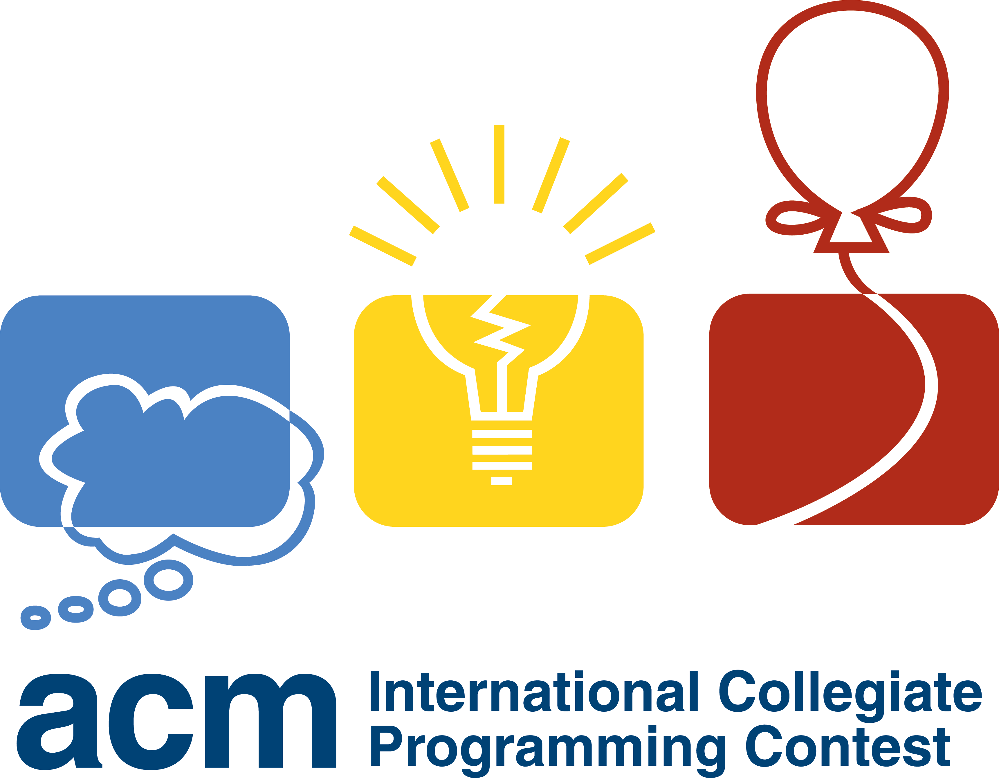
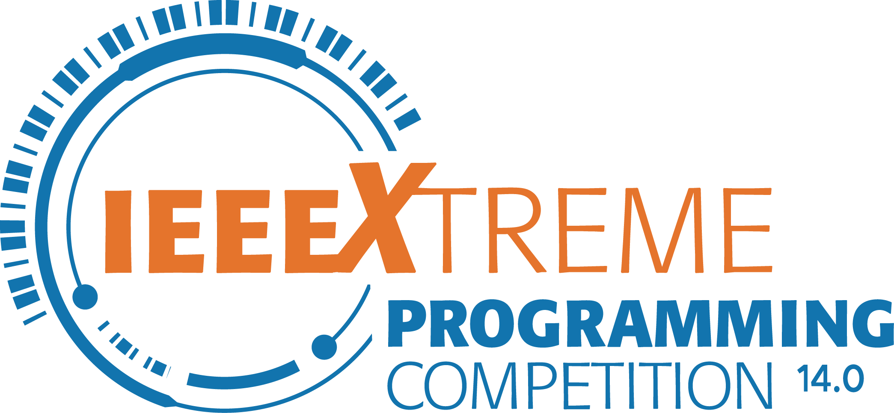

---

marp: true
theme: default
class: invert
paginate: true
author: Rodrigo Alvarez
lang: es-CL
transition: slide

---

<!--
- presentarse
- dar la bienvenida a informatica
-->

# Estructura de datos y algoritmos


Rodrigo Alvarez
rodrigo.alvarez2@mail.udp.cl

---

<!--
- hablar de mi experiencia con el ramo
-->

## ¿Por qué estudiar sobre estructura de datos y algoritmos ?

---

<!-- 
- elegir la herramienta adecuada para el problema facilita la resolución
-->

## ¿Por qué estudiar sobre estructura de datos y algoritmos ?

 - <u>Resolución de problemas</u>: Muchos problemas de programación y algoritmos se pueden resolver más fácilmente utilizando estructuras de datos adecuadas.

---

<!--
- la organización de los datos es fundamental para su manipulación
- patrones de acceso y manipulación
- evita repetir lógica
-->

## ¿Por qué estudiar sobre estructura de datos y algoritmos ?

 - <u>Resolución de problemas</u>: Muchos problemas de programación y algoritmos se pueden resolver más fácilmente utilizando estructuras de datos adecuadas.

 - <u>Organización</u>: Las estructuras de datos te permiten organizar y almacenar datos de manera adecuada para acceder a ellos y manipularlos de manera eficiente.

---

<!--
- la abstracción permite pensar en términos de conceptos abstractos
- evitar pensar en detalles de implementación
- pensar en términos de la interfaz que entrega la estructura para su uso
-->

## ¿Por qué estudiar sobre estructura de datos y algoritmos ?

 - <u>Resolución de problemas</u>: Muchos problemas de programación y algoritmos se pueden resolver más fácilmente utilizando estructuras de datos adecuadas.

 - <u>Organización</u>: Las estructuras de datos te permiten organizar y almacenar datos de manera adecuada para acceder a ellos y manipularlos de manera eficiente.

  - <u>Abstracción</u>: Proporcionan una abstracción para trabajar con datos. Permiten pensar en términos de conceptos abstractos (listas, pilas, colas, árboles, grafos, etc.) en lugar de preocuparte por los detalles de implementación subyacentes.

---

<!--
- la elección de la estructura de datos y algoritmo adecuado puede mejorar significativamente el rendimiento
- la eficiencia es fundamental en el desarrollo de software
- van a conocer como se implementan
- van a poder elegir la estructura adecuada para el problema
-->

## ¿Por qué estudiar sobre estructura de datos y algoritmos ?

 - <u>Resolución de problemas</u>: Muchos problemas de programación y algoritmos se pueden resolver más fácilmente utilizando estructuras de datos adecuadas.

 - <u>Organización</u>: Las estructuras de datos te permiten organizar y almacenar datos de manera adecuada para acceder a ellos y manipularlos de manera eficiente.

  - <u>Abstracción</u>: Proporcionan una abstracción para trabajar con datos. Permiten pensar en términos de conceptos abstractos (listas, pilas, colas, árboles, grafos, etc.) en lugar de preocuparte por los detalles de implementación subyacentes.

  - <u>Eficiencia</u>: Al comprender cómo funcionan diferentes estructuras de datos y cuándo utilizarlas, el elegir la adecuada puede mejorar significativamente el rendimiento de los algoritmos y programas.

---

<!--
- competencias de programación
- primera parte competencias universitarias
- empresas buscan habilidades con algoritmos y estructuras de datos
- entrevistas
-->






---

# Unidades Temáticas

---

<!--
- no enseñaré java en profundidad
- no es un curso de programación
- sabremos como identificar si el algoritmo es optimo
- ANTES de la primera solemne
-->

## Bloque 1
### Introducción a Java y estructuras básicas

 - Introducción a java y librería estándar
 - Notación asintótica
 - Listas/Pilas/Colas
 - Recursión, call stack
 - Algoritmos de ordenamiento
 - Algoritmos de búsqueda

---

<!-- 
- veremos estructuras avanzadas
- árboles, grafos, set y map
- algoritmos de búsqueda y recorrido
- ANTES de la segunda solemne
-->

## Bloque 2:
### Estructuras de datos avanzadas

 - Árboles
 - Set y Map
 - Grafos
 - Algoritmos de búsqueda y recorrido

--- 
<!--
- con el tiempo que nos queda
- DESPUES de la segunda solemne
- con las herramientas aprendidas, veremos algoritmos de optimización
-->

## Bloque 3:
### Bonus

 - Programación dinámica
 - Búsqueda informada

---

## Evaluaciones
```python
cantidad_solemnes = 2
cantidad_controles ~= 4
cantidad_labs ~= 5
```

### fechas
>solemne 1: semana 24/04 - 30/04
solemne 2: semana 24/06 - 28/06
examen: semana 08/07 - 17/07

#### fechas tentativas:
>controles: 25/03, 08/04, 27/05, 10/06
labs: 18/03, 01/04, 15/04, 13/05, 03/06

---

## Ponderaciones

- <small>NP: nota de presentación</small>
- <small>NC: nota de controles</small>
- <small>NL: nota de laboratorios</small>
- <small>NS: nota de solemnes</small>

```python
NP = 0.3 * NC + 0.3 * NL + 0.4 * NS

eximido = NP >= 5.0 && NC >= 4.0 && NL >= 4.0 && NS >= 4.0
```


- <small>NE: nota de examen</small>

- <small>NF: nota final</small>


```python
NF = 0.7 * NP + 0.3 * NE
```

---

## Cambio de día catedra

---

<!--
- Kevin Wayne es coautor de uno de los libros de referencia
- cursos en coursera que pueden encontrar dentro del sitio
-->

## Recursos
### Cursos
 - [Java for Beginners](https://youtu.be/j9VNCI9Xo80?si=aDgYYokJRwmFWl-f)
 - [MIT 6.006 Introduction to Algorithms, Spring 2020](https://youtube.com/playlist?list=PLUl4u3cNGP63EdVPNLG3ToM6LaEUuStEY&si=FDZqn576CNFcs_lA)
 - [Kevin Wayne site](https://www.cs.princeton.edu/~wayne/teaching/)
### Plataformas
 - [Codewars](https://www.codewars.com/)
 - [LeetCode](https://leetcode.com/)
 - [HackerRank](https://www.hackerrank.com/domains/java)
 - [Codeforces](https://codeforces.com/)

---

## Bibliografía
<!-- 
- El primero es el libro guía
- El clrs (ultimo) es el libro de algoritmos por excelencia 
-->

 - R. Sedgewick, K. Wayne, Algorithms. Addison-Wesley, 2014.
 - Robert Sedgewick, Kevin Wayne - Introduction to Programming in Java (2017)
 - J. Kleinberg and E. Tardos, Algorithm design. Boston, Mass: Pearson/Addison-Wesley, 2006.
 - S.S. Skiena, M.A. Revilla. Programming Challenges. Springer Verlag, 2003.
 - Cormen, Thomas H.; Leiserson, Charles E.; Rivest, Ronald L.; Stein, Clifford (2009) [1990]. Introduction to Algorithms (3rd ed.). MIT Press and McGraw-Hill.

---

