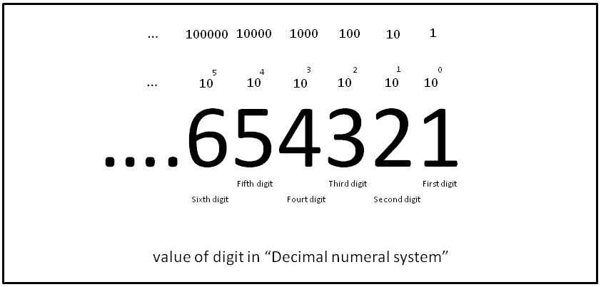

---

marp: true
theme: default
class: invert
paginate: true
author: Rodrigo Alvarez
lang: es-CL
transition: slide
footer: Algoritmos
math: mathjax

---

# Estructura de datos y algoritmos

Rodrigo Alvarez
rodrigo.alvarez2@mail.udp.cl

---

## Problema computacional

Un problema computacional se puede describir como un enunciado que describe la relación entre un conjunto de datos de entrada y otro de salida.
El enunciado debe proveer una serie de propiedades para verificar que un determinado valor de salida está relacionado a una instancia de entrada.

---

## Algoritmo

Un algoritmo es un conjunto de instrucciones finitas y bien definidas que transforman cada instancia de entrada de un problema en un valor de salida especifico.

---

## Análisis de algoritmos

 - Funcionamiento correcto
 - Eficiencia en el tiempo de ejecución
 - Eficiencia en el espacio

---

## Correctitud

La correctitud de un algoritmo se refiere a la propiedad de un programa o sistema de cumplir con sus especificaciones y producir los resultados correctos para todas las posibles entradas.

---

## Métricas de comparación de algoritmos

  - Tiempo de ejecución
  - Espacio en memoria
  - Uso de procesadores
  - Uso de dispositivos de entrada/salida

Es importante tener en cuenta que la **elección de un algoritmo** o una implementación **depende** en gran medida del **contexto** y el **hardware** a utilizar.

<!-- En este curso, nos enfocamos principalmente en el análisis de la complejidad temporal como métrica principal para comparar algoritmos.
-->

---

## Eficiencia

En un principio para ver qué tantos recursos (RAM y CPU) gasta un algoritmo es posible realizar una medición de estos.
Sin embargo, se debe tener en cuenta que el algoritmo se comportará de diferente manera en diferentes máquinas.

---

## Ejemplo: Convertir número decimal a binario

---

## Sistema posicional

El sistema o notación posicional es un sistema numérico en el que el valor actual de un número viene dado por las posiciones de los dígitos que lo conforman.

Los números que usamos a diario como 153 o 365 pertenecen al sistema posicional base 10, conocido también como el sistema decimal.

---

## Sistema decimal

El sistema decimal hace uso de 10 dígitos que van desde el 0 hasta el 9, con sus respectivas posiciones (unidad, decena, centena y así sucesivamente). El sistema decimal en el conjunto de los naturales (incluyendo el cero) se puede generalizar como:

$$\sum_{i\in\mathbb{N}}{a_i \cdot 10^{i}}, \text{donde }  a_i \in \set{0,1,2,3,4,5,6,7,8,9}$$

---

## Sistema binario

El sistema binario hace uso de 2 dígitos, 0 o 1, que con sus respectivas posiciones
permiten representar el valor de un número. Haciendo el mismo ejercicio con el
sistema decimal, el sistema binario se puede representar como:

$$\sum_{i\in\mathbb{N}}{a_i \cdot 2^{i}}, \text{donde }  a_i \in \set{0,1}$$

---

## Problema

Como caso de estudio consideremos el problema de transformar un número decimal a binario. Donde tendremos como **input** un número entero n, y como **output**  una secuencia de caracteres que represente n en el sistema binario.

---

[decimal a binario](https://onecompiler.com/challenges/424ydc5ua/binary-number)

---

[Como analizar algoritmos](https://youtu.be/IZgOEC0NIbw?si=R1gBjmLBqOMgigt4)

[Guidelines for Asymptotic Analysis](https://youtu.be/BpiMRyWoDu0?si=FeWgFFnc4sQFkhij)

[Máquina de turing](https://youtu.be/S1PVPluvV9I?si=gzClhcJHhSf5KQym)