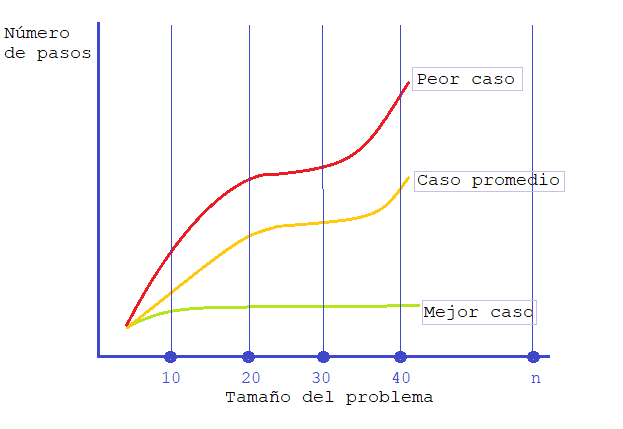
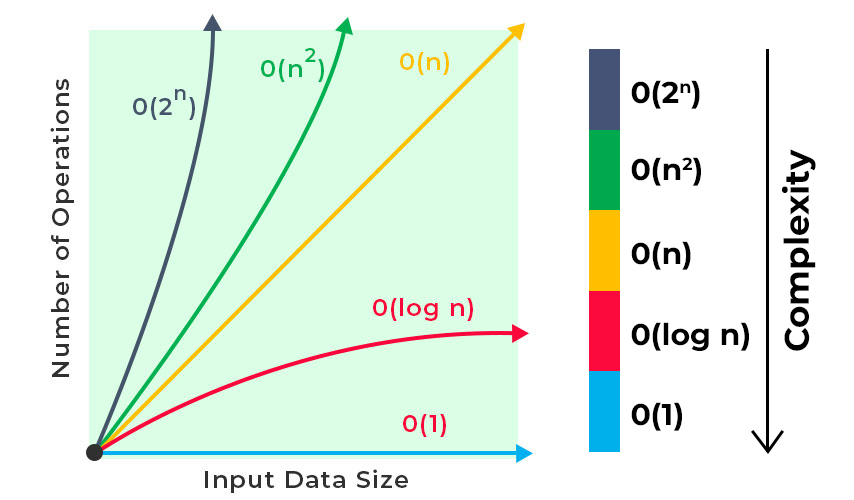
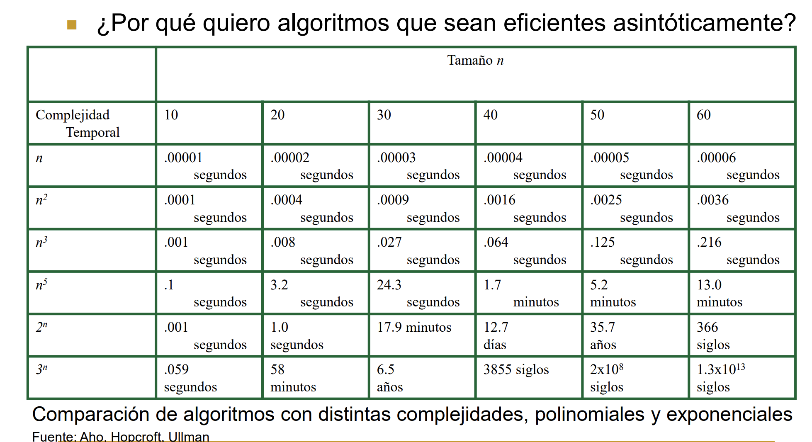
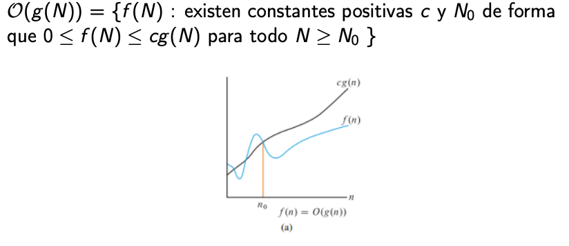
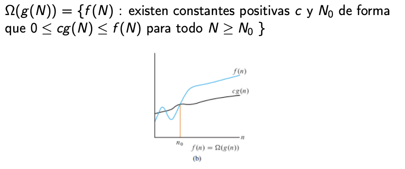
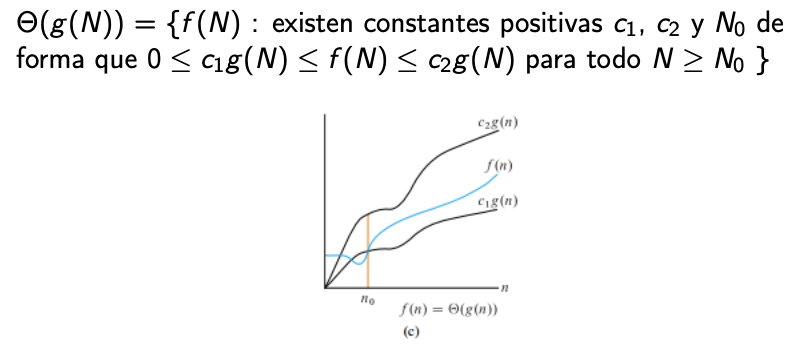

---

marp: true
theme: default
class: invert
paginate: true
author: Rodrigo Alvarez
lang: es-CL
transition: slide
footer: Complejidad
math: mathjax

---

# Estructura de datos y algoritmos

Rodrigo Alvarez
rodrigo.alvarez2@mail.udp.cl

---

## Eficiencia de tiempo de ejecución

---

## Análisis de complejidad temporal

El análisis de complejidad temporal es una técnica que permite determinar cuánto tiempo tardará un algoritmo en ejecutarse en función del tamaño de los datos de entrada.

 - Empírica o experimental: Consiste en medir el tiempo de ejecución en una computadora específica para una entrada dada.

 -  Teórica: Se expresa en términos de la función matemática que representa el tiempo que tarda el algoritmo en función del tamaño de la entrada.

---

### Ejemplo de análisis empírico

<a href="https://onecompiler.com/embed/java/427w6q834?theme=dark">
  <iframe
    frameBorder="0"
    height="450px"  
    src="https://onecompiler.com/embed/java/427w6q834?theme=dark" 
    width="100%"
  >
 </iframe>
</a>

<!-- 
Existen varios problemas en hacer un análisis empírico o experimental del tiempo de ejecución de los algoritmos:
 - La variabilidad: Las mediciones pueden variar significativamente según el hardware utilizado y las condiciones en que se ejecuta el algoritmo. Por lo tanto, es difícil hacer comparaciones significativas entre diferentes algoritmos.
 - Las limitaciones de hardware: El hardware utilizado puede limitar el rendimiento del algoritmo y hacer que el análisis sea impreciso. Además, los recursos de hardware, como la memoria y el procesador, pueden ser compartidos con otros procesos, lo que puede afectar la medición del tiempo de ejecución.
 - La selección de entradas: La elección de entradas para el análisis puede influir en el resultado. Si se seleccionan entradas atípicas o muy específicas, el rendimiento del algoritmo puede ser diferente en comparación con otras entradas.
 - La complejidad de la implementación: La complejidad de la implementación del algoritmo puede afectar el rendimiento. Por ejemplo, una implementación ineficiente puede hacer que el tiempo de ejecución sea mayor de lo que debería ser.
 - El costo y la dificultad de la medición: Medir el tiempo de ejecución puede ser costoso y difícil. Por ejemplo, puede ser necesario medir el tiempo de ejecución varias veces para obtener un resultado preciso, lo que puede llevar tiempo y recursos adicionales.
-->

---

## Análisis teórico

El análisis de complejidad es una herramienta fundamental para el diseño y optimización de algoritmos. Este análisis es basado en un "modelo de máquina" o "modelo de cómputo consensuado" se presenta como una medida "universal" válida para distintas implementaciones del algoritmo.
  - La **medida del tiempo** se refiere al número de instrucciones u operaciones elementales (OE) que se ejecutan en la máquina "ideal" para determinado input en función del tamaño del mismo.
  - La **medida espacial** se refiere a la cantidad de memoria necesaria para resolver un problema en la máquina ideal.

---

## Análisis de los distintos casos

Diferentes entradas de la misma longitud pueden causar que el algoritmo se comporte distinto, por lo que se podría analizar el algoritmo desde tres perspectivas: **el mejor caso**, **el caso promedio** y **el peor caso**.



---

## Operaciones elementales

Las operaciones elementales son aquellas operaciones básicas que el procesador puede realizar en un tiempo acotado por una constante, es decir, que no dependen del tamaño de la entrada. Estas operaciones incluyen las operaciones aritméticas básicas como la suma, resta, multiplicación y división, las comparaciones lógicas como mayor que, menor que, igual a, y las asignaciones a variables de tipos básicos como enteros, flotantes o caracteres.

Es importante tener en cuenta que el conjunto de operaciones elementales puede variar según el modelo de cómputo que se utilice.

---

## Cálculo de Operaciones elementales
Existen tres casos principales para los cuales se pueden calcular las operaciones elementales de un algoritmo: el peor caso, el mejor caso y el caso promedio.
 - Peor caso: Se calcula el número de operaciones elementales para el input que genere el peor rendimiento del algoritmo. Esto es importante porque permite garantizar que el algoritmo siempre funcionará en un tiempo acotado, independientemente de los datos de entrada.
 - Mejor caso: Se calcula el número de operaciones elementales para el input que genere el mejor rendimiento del algoritmo.
 - Caso promedio: Se calcula el número de operaciones elementales para una distribución de inputs típicos en la tarea en cuestión. El caso promedio es importante para entender el rendimiento esperado del algoritmo en situaciones reales.


---

## Ejemplo de cálculo de Operaciones Elementales (OE’s)

<div style="display:flex;align-items:center;">


  <div style="width: 90%;">

  ```java
  1: public static boolean findInArray(int[] arr, int num) {
  2:    for (int i = 0; i < arr.length; i++) {
  3:      if (arr[i] == num) {
  4:        return true;
  5:      }
  6:    }
  7:    return false;
  8:  }
  ```

  </div>


  <div style="font-size:17px;">

  - 1: define la función y los argumentos que recibe.No hay operaciones elementales que contar en esta línea.
  - 2: inicia un ciclo for que recorre el arreglo. Se realizan tres operaciones elementales: una asignación (i = 0),  una comparación (i < arr.length) y al final de cada ciclo se ejecuta i++.
  - 3: verifica si el elemento actual es igual al valor buscado. Hay una comparación (arr[i] == x) y una acceso arr[i] que cuentan como dos operaciones elementales.
  - 4: si se encuentra el valor buscado, la función retorna verdadero. Esta linea cuenta como una operación elemental.
  - 7: si se termina el ciclo sin encontrar el valor buscado, la función retorna falso. Esta linea cuenta como una operación elemental.
    
  </div>

</div>


---

## Ejemplo de cálculo del mejor caso

<div style="display:flex;align-items:center;">


  <div style="width: 90%;">

  ```java
  1: public static boolean findInArray(int[] arr, int num) {
  2:    for (int i = 0; i < arr.length; i++) {
  3:      if (arr[i] == num) {
  4:        return true;
  5:      }
  6:    }
  7:    return false;
  8:  }
  ```

<small style="font-size: 16px;">

- $L2_i$: Inicialización del for cuenta como 1 OE
- $L2_c$: Condición del for cuenta como 1 OE
- $L3$: 2 OE (acceso a arreglo y comparación)
- $L4$: 1 OE

</small>

  </div>


  <div style="font-size:17px;">

  - El mejor caso de esta función es que el elemento a buscar esté en la primera posición. 
  - Para representar el mejor caso sólo será necesario revisar la primera posición del arreglo. 
  - La función que indica el tiempo que se demorar nuestro algoritmo en función de la entrada n es: $T(n) = L2_i + L2_c + L3 + L4$
  - Reemplazando en la formula: $T(n) = 1 + 1 + 2 + 1 = 5$
  - Podemos ver que la función T(n) no tiene dependencia de n, esto es debido a que al no ejecutar más de una iteración del ciclo, la dependencia del tamaño de la entrada desaparece.

    
  </div>

</div>


---

## Ejemplo de cálculo del peor caso

<div style="display:flex;align-items:center;">


  <div style="width: 90%;">

  ```java
  1: public static boolean findInArray(int[] arr, int num) {
  2:    for (int i = 0; i < arr.length; i++) {
  3:      if (arr[i] == num) {
  4:        return true;
  5:      }
  6:    }
  7:    return false;
  8:  }
  ```

<small style="font-size: 16px;">

- $L2_i$: Inicialización del for cuenta como 1 OE
- $L2_c$: Condición del for cuenta como 1 OE
- $L2_{in}$: Incremento del for, se ejecuta cuando termina una iteración del ciclo, cuenta como 1 OE
- $L3$: 2 OE (acceso a arreglo y comparación)
- $L4$: 1 OE
- $L7$: 1 OE

</small>

  </div>


  <div style="font-size:17px;">

  - El peor caso de esta función es que el elemento no esté presente.
  - Este caso indicará que el arreglo de tamaño N debe ser recorrido completamente.
  - Para representar el peor caso, será necesario recorrer el arreglo hasta terminarlo y luego retornar falso en la L7.
  - La función que indica el tiempo que se demorar nuestro algoritmo en función de la entrada n es: $T(n) = L2_i + \sum_{i=1}^{n}(L2_c + L3 + L2_{in}) + L7$
  - Reemplazando en la fórmula: $T(n) = 1 + \sum_{i=1}^{n}(1+2+1) + 1 = 4n + 2$
  - La función FindInArray en el peor de los casos se comporta como la función T(n).

  </div>

</div>

---

## Ejemplo de cálculo del caso promedio

<div style="display:flex;align-items:center;">


  <div style="flex-basis: 1900px;">

  ```java
  1: public static boolean findInArray(int[] arr, int num) {
  2:    for (int i = 0; i < arr.length; i++) {
  3:      if (arr[i] == num) {
  4:        return true;
  5:      }
  6:    }
  7:    return false;
  8:  }
  ```

<small style="font-size: 16px;">

- $L2_i$: Inicialización del for cuenta como 1 OE
- $L2_c$: Condición del for cuenta como 1 OE
- $L2_{in}$: Incremento del for, se ejecuta cuando termina una iteración del ciclo, cuenta como 1 OE
- $L3$: 2 OE (acceso a arreglo y comparación)
- $L4$: 1 OE
- $L7$: 1 OE

</small>

  </div>


  <div style="font-size:17px;">

  - Como existen n posiciones en el arreglo, supondremos a priori que todas las posiciones son equis probables de contener el número buscado, por lo tanto cada una tendrá una probabilidad de 1/n. Es decir, en promedio el ciclo se ejecutará $\sum_{i=0}^{n-1}i\cdot \frac{1}{n} = \frac{n-1}{2}$ veces.
  - Escribiendo la fórmula T(n) con esta cantidad esperada de iteraciones queda: $T(n) = L2_i + \sum_{i=1}^{\frac{n-1}{2}}(L2_c + L3 + L2_{in}) + L2_c + L3 + L_4$
  - Reemplazando: $T(n) = 5 + \sum_{1}^{\frac{n-1}{2}}(4) = 2n + 3$

  </div>

</div>

---

## Tamaño de la entrada

 - Por qué la complejidad en función del tamaño de la entrada?
 - Queremos una complejidad relativa, no absoluta
 - Una medida general de la ejecución, no nos interesa cuánto demora la instancia particular, sino que el algoritmo en general
 - Es más abstracta que pensar en función de cada input (Sabiendo que podrían existir infinitos inputs distintos)


 - T(n): complejidad temporal para una entrada de tamaño n

---

## Análisis asintótico

El análisis asintótico es una técnica de análisis que permite describir la complejidad espacial o temporal de un algoritmo mediante el orden de crecimiento.

El orden de crecimiento se caracteriza mediante una función matemática, esta es la que describe la relación entre tiempo y tamaño de la entrada, o uso de memoria y tamaño de la entrada.





---




---

## Big O



---

## Big O

- Caracteriza la cota superior de una función, es decir que la función en cuestión no crece más rápido que un cierto ratio.
- Esta notación se usa para caracterizar el peor caso de tiempo de ejecución o memoria para un algoritmo.
- Digamos que un determinado algoritmo tiene tiempo de
ejecución en función de $T(N) = 7N^3 + 5N^2 − 20N + 7$. Esto en términos de Big O podría traducirse como $T(N) = O(N^3)$.
- La razón es que $7N^3 + 5N^2 − 20N + 7 ≤ cN^3$ con $c$ como una constante positiva.

---
## Big Omega



---

## Big Omega (Ω)
- La notación Notación Ω, conocida como Omega caracteriza la cota inferior de una función.
- Para el caso del ejemplo $T(N) = 7N^3 + 5N^2 − 20N + 7$, podemos decir que en términos de notación Omega el tiempo de ejecución es en magnitud de $Ω(N^3)$, $Ω(N^2)$ o incluso $Ω(1)$, siempre y cuando exista un $N$ para ese caso.

---

## Big Theta



---

## Big Theta (Θ)
- La notación Notación $Θ$, conocida como Theta caracteriza la cota ajustada de una función.
- Para el caso del ejemplo $T(N) = 7N^3 + 5N^2 − 20N +7$, si $T(N) = Ω(N^3)$ y $T(N) = O(N^3)$, entonces se puede decir $T(N) = Θ(N^3)$.

---

