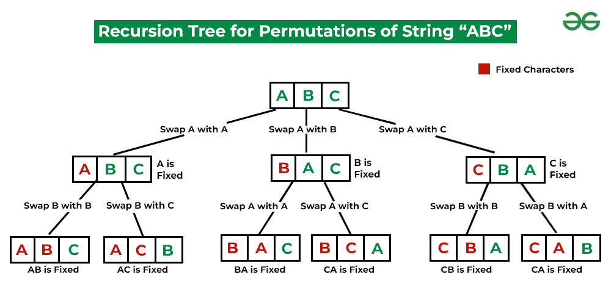
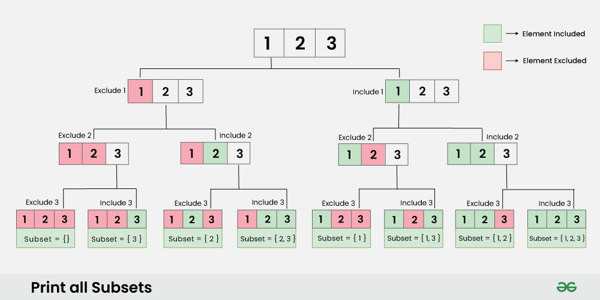

---

marp: true
theme: default
class: invert
paginate: true
author: Rodrigo Alvarez
lang: es-CL
transition: slide
footer: Combinatorios
math: mathjax

---

# Estructura de datos y algoritmos

Rodrigo Alvarez
rodrigo.alvarez2@mail.udp.cl

---

## Combinatoria

La combinatoria es una rama de estudio de las matemáticas discretas, para el contexto del curso ciertos conceptos son elementales para entender algunos algoritmos, especialmente cuando se revisen problemas de árboles y grafos.

---

## Permutaciones

Una permutación es el reordenamiento de un conjunto. Un arreglo de $N$ elementos tiene $N!$ posibles permutaciones.


---



---

```java
static void permutations(int[] A, int lo, int hi) {
    if (lo == hi) {
      for (int i = 0; i < A.length; ++i) {
        System.out.printf(" %d ", A[i]);
      }
      System.out.println();
      return;
    }
    for (int i = lo; i <= hi; ++i) {
      // swap the i-th with the low
      int temp = A[lo];
      A[lo] = A[i];
      A[i] = temp;

      permutations(A, lo + 1, hi);

      // swap back to restore the original order
      temp = A[lo];
      A[lo] = A[i];
      A[i] = temp;
    }
  }
```

---

## Subconjuntos

Un conjunto de N elementos tiene $2^N$ posibles subconjuntos incluyendo al mismo conjunto y el conjunto vacío

---


---

```java
static void subsets ( List<Integer> subset, int lo, int hi ) {
  if( lo == hi + 1) {
    for (int n : subset ) {
      System.out.printf(" %d ", n );
    }
    System.out.println();
    return ;
  }
  subset.add( lo ) ;
  subsets( subset , lo + 1 , hi ) ;
  subset.removeLast() ;
  subsets( subset , lo + 1 , hi ) ;
}
```

---

## Subarreglos

Un subarreglo de un arreglo $A$ de $N$ elementos se suele denotar $A[i : j]$, donde $0 ≤ i ≤ j ≤ N$, un subarreglo podríamos decir que es un pedacito secuencial del arreglo, donde un arreglo de $N$ elementos tiene $N(N + 1)/2$ posibles subarreglos.

---

```java
  static void subarrays(int[] A, int lo, int hi) {
    if (hi == A.length)
      return;

    if (lo > hi) {
      subarrays(A, 0, hi + 1);
      return;
    }

    for (int i = lo; i <= hi; ++i) {
      System.out.printf(" %d ", A[i]);
    }
    System.out.println();

    subarrays(A, lo + 1, hi);
  }
```

---

- [Sum of All Subset XOR Totals](https://leetcode.com/problems/sum-of-all-subset-xor-totals/description/)
- [Distribute Candies Among Children I](https://leetcode.com/problems/distribute-candies-among-children-i/description/)