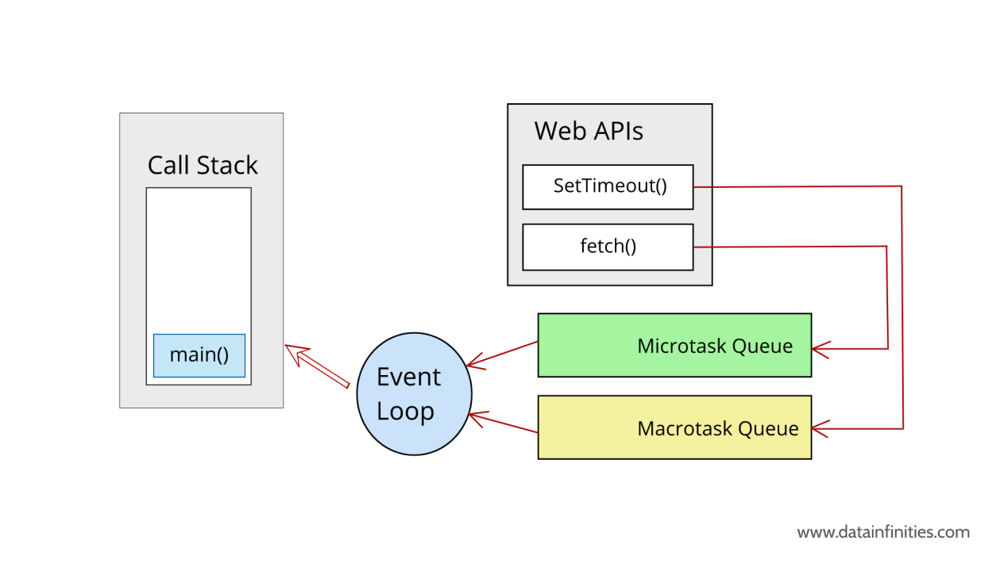
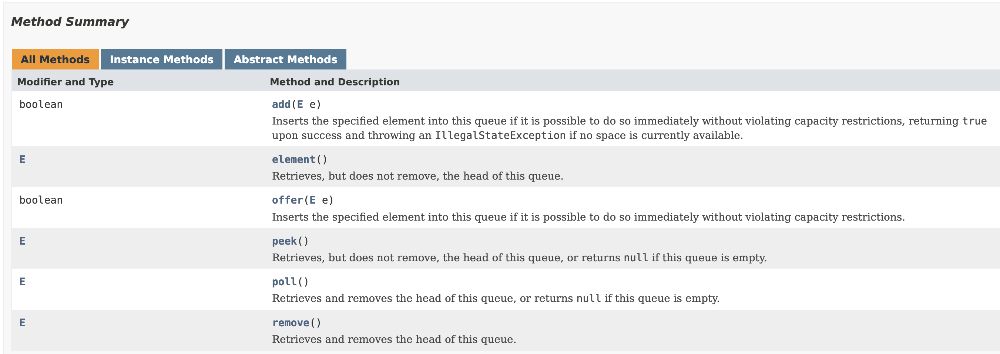

---

marp: true
theme: default
class: invert
paginate: true
author: Rodrigo Alvarez
lang: es-CL
transition: slide
footer: Pila y Cola
math: mathjax

---

# Estructura de datos y algoritmos

Rodrigo Alvarez
rodrigo.alvarez2@mail.udp.cl

---


## Recordatorio: TDA
- **Tipo de dato abstracto** (TDA): Una especificación de un conjunto de datos y las operaciones que pueden ser realizadas sobre esos datos.
  - Describe qué hace, no cómo lo hace.
- No sabemos exactamente cómo se implementa, solo qué hace y qué operaciones podemos hacer.
   - Solo necesitamos entender la idea de la colección de datos y las operaciones que puede realizar.


---

## Pilas y colas
- **pila**: El único elemento accesible es el ultimo añadido.
- **cola**: El único elemento accesible es el que se añadió más temprano.
- Menos posibilidades de operaciones que una lista pero más eficientes.


---

## Pila (stack)

<small>

- **LIFO**: Last In First Out
- Los elementos son guardados en el orden de inserción
  - No solemos pensar en la posición de los elementos, solo en el último añadido.
- El "cliente" solo puede acceder al último elemento añadido.

<hr />

- Operaciones básicas:
  - push: añadir un elemento
  - pop: quitar el último elemento añadido
  - peek (o top): ver el último elemento añadido

</small>


---

## Pila (stack)


---
## [Class Stack](https://docs.oracle.com/javase/8/docs/api/java/util/Stack.html)

`java.util.Stack`


---

## Class stack

<a href="https://onecompiler.com/embed/java/428jybu4h?theme=dark">
<iframe
 frameBorder="0"
 height="450px"  
 src="https://onecompiler.com/embed/java/428jybu4h?theme=dark" 
 width="100%"
 >
</iframe>
</a>

---


- Para iterar sobre una pila se usa un bucle `while` para vaciarla.

```java
  while (!stack.isEmpty()) {
    System.out.println(stack.pop());
  }
```

---


## Cola (queue)

<small>

- **FIFO**: First In First Out
- Los elementos son guardados en el orden de inserción y no suelen tener indices.
- El "cliente" puede añadir elementos al final y examinar/quitar elementos del principio.

<hr />

- Operaciones básicas:
  - enqueue: añadir un elemento al final
  - dequeue: quitar el elemento del principio
  - peek: ver el elemento del principio

</small>


---

## Cola (queue)




---

## [Interface Queue](https://docs.oracle.com/javase/8/docs/api/java/util/Queue.html)

`java.util.Queue`



---

## Interface queue

<a href="https://onecompiler.com/embed/java/42rn543m4?theme=dark">
<iframe
 frameBorder="0"
 height="450px"  
 width="100%"
 src="https://onecompiler.com/embed/java/42rn543m4?theme=dark"
 >
</iframe>
</a>

---
## Ejercicios
- List
  - [Reverse a doubly linked list (easy)](https://www.hackerrank.com/challenges/reverse-a-doubly-linked-list/problem)
  - [Cycle Detection (medium)](https://www.hackerrank.com/challenges/detect-whether-a-linked-list-contains-a-cycle/problem)
  - [Get Node Value (easy)](https://www.hackerrank.com/challenges/get-the-value-of-the-node-at-a-specific-position-from-the-tail/problem)
- Stack
  - [Equal stacks (easy)](https://www.hackerrank.com/challenges/equal-stacks/problem)
  - [Balanced brackets (medium)](https://www.hackerrank.com/challenges/balanced-brackets/problem)
- Queue
  - [Queue using two stacks (medium)](https://www.hackerrank.com/challenges/queue-using-two-stacks/problem)
