---

marp: true
theme: default
class: invert
paginate: true
author: Rodrigo Alvarez
lang: es-CL
transition: slide
footer: Resumen
math: mathjax

---

# Estructura de datos y algoritmos

Rodrigo Alvarez
rodrigo.alvarez2@mail.udp.cl

---


## Análisis de complejidad temporal

El análisis de complejidad temporal es una técnica que permite determinar cuánto tiempo tardará un algoritmo en ejecutarse en función del tamaño de los datos de entrada.

 - Empírica o experimental: Consiste en medir el tiempo de ejecución en una computadora específica para una entrada dada.

 -  Teórica: Se expresa en términos de la función matemática que representa el tiempo que tarda el algoritmo en función del tamaño de la entrada.

---


## Análisis asintótico

El análisis asintótico es una técnica de análisis que permite describir la complejidad espacial o temporal de un algoritmo mediante el orden de crecimiento.

El orden de crecimiento se caracteriza mediante una función matemática, esta es la que describe la relación entre tiempo y tamaño de la entrada, o uso de memoria y tamaño de la entrada.


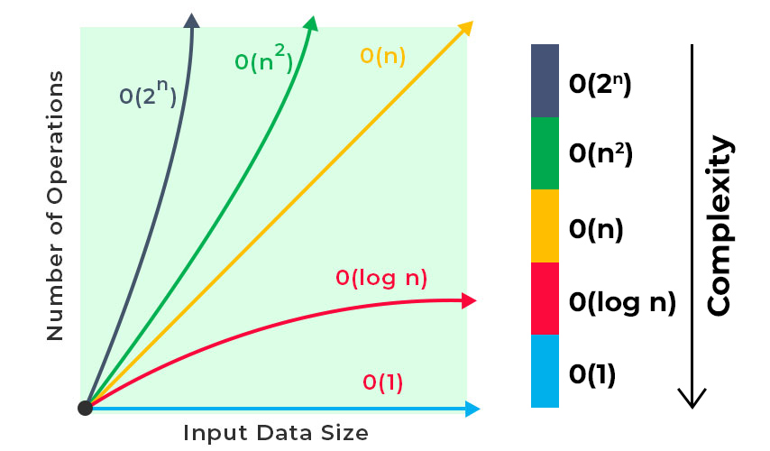


---


---

## Big O

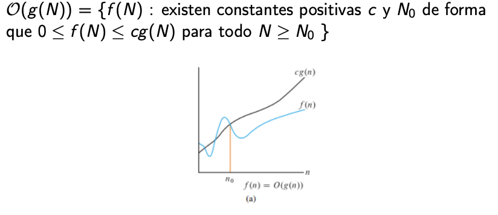

---

## Big O

- Caracteriza la cota superior de una función, es decir que la función en cuestión no crece más rápido que un cierto ratio.
- Esta notación se usa para caracterizar el peor caso de tiempo de ejecución o memoria para un algoritmo.
- Digamos que un determinado algoritmo tiene tiempo de
ejecución en función de $T(N) = 7N^3 + 5N^2 − 20N + 7$. Esto en términos de Big O podría traducirse como $T(N) = O(N^3)$.
- La razón es que $7N^3 + 5N^2 − 20N + 7 ≤ cN^3$ con $c$ como una constante positiva.

---
## Big Omega

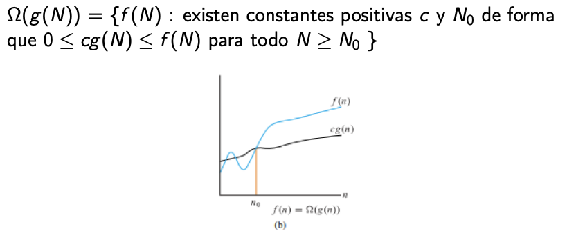

---

## Big Omega (Ω)
- La notación Notación Ω, conocida como Omega caracteriza la cota inferior de una función.
- Para el caso del ejemplo $T(N) = 7N^3 + 5N^2 − 20N + 7$, podemos decir que en términos de notación Omega el tiempo de ejecución es en magnitud de $Ω(N^3)$, $Ω(N^2)$ o incluso $Ω(1)$, siempre y cuando exista un $N$ para ese caso.

---

## Big Theta

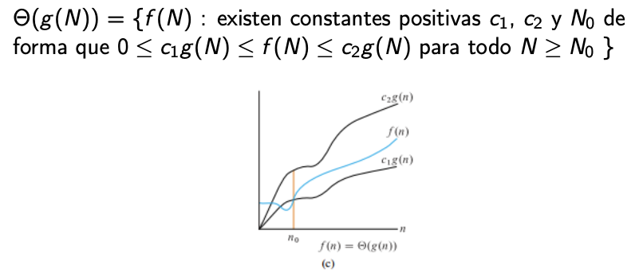

---

## Big Theta (Θ)
- La notación Notación $Θ$, conocida como Theta caracteriza la cota ajustada de una función.
- Para el caso del ejemplo $T(N) = 7N^3 + 5N^2 − 20N +7$, si $T(N) = Ω(N^3)$ y $T(N) = O(N^3)$, entonces se puede decir $T(N) = Θ(N^3)$.

---

## Divisibilidad

En matemáticas, la divisibilidad es la propiedad de un número de ser divisible entre otro número sin dejar un residuo. El número entero $b$ divide al entero $a$ si y solo sí $a=b \cdot k$ para algún entero $k$. En la nomenclatura también es posible decir que $a$ es divisible por $b$ o que $b$ es **divisor** de $a$ y escribimos esto como $b\mid a$. Si $b$ no divide a $a$, escribimos $b\nmid a$. 


---

## Divisibilidad

Por ejemplo:
- 10 es divisible por 5 ($5\mid 10$) porque $10 \div 5 = 2$ con un residuo de $0$.
- 23 es divisible por 1 ($1\mid 23$) porque $23 \div 1 = 23$ con un residuo de $0$.
- 9 no es divisible por 7 ($7\nmid 9$) porque $9\div 7 = 1$ con un residuo de $2$.

Para validar si un número entero es divisor de otros se hace verificando si el residuo de la división es cero.
Este concepto es central y tiene una aplicación directa en muchos problemas algorítmicos.

---

## Números Primos

Los números primos son elementos fundamentales en matemáticas y juegan un papel crucial en la teoría de números, algoritmos, y diversas aplicaciones prácticas, como la criptografía. Un número primo es un número entero mayor que 1 que solo tiene dos divisores: 1 y sí mismo.

Todo número entero $p$ que es solo divisible por 1 y sí mismo se dice que es un número primo. 

---

## Números Primos

- Ejempos de números primos:
    - 2 es primo porque solo se puede dividir por 1 y 2.
    - 3 es primo porque solo se puede dividir por 1 y 3.
    - 5 es primo porque solo se puede dividir por 1 y 5.
- Ejemplos de números no primos: 
    - 4 no es primo porque puede dividirse por 1, 2 y 4.
    - 6 no es primo porque puede dividirse por 1, 2, 3 y 6.

---

## Prueba de divisibilidad básica

Una manera sencilla de determinar si un número entero N es primo es comprobando si es o no divisible por algún número entre 2 y $\sqrt{N}$. No es necesario comprobar los mayores a $\sqrt{N}$ porque sus pares ya habrán aparecido con divisores menores.
De esta manera si N es divisible por cualquier número en el rango no sería primo, y si se cumple el caso contrario y N no es divisible por ningún valor dentro de ese rango, significa que N es primo.

---

## Sistema posicional

El sistema o notación posicional es un sistema numérico en el que el valor actual de un número viene dado por las posiciones de los dígitos que lo conforman.

Los números que usamos a diario como 153 o 365 pertenecen al sistema posicional base 10, conocido también como el sistema decimal.


---

## Sistema decimal

El sistema decimal hace uso de 10 dígitos que van desde el 0 hasta el 9, con sus respectivas posiciones (unidad, decena, centena y así sucesivamente). El sistema decimal en el conjunto de los naturales (incluyendo el cero) se puede generalizar como:

$$\sum_{i\in\mathbb{N}}{a_i \cdot 10^{i}}, \text{donde }  a_i \in \set{0,1,2,3,4,5,6,7,8,9}$$

---

## Sistema binario

El sistema binario hace uso de 2 dígitos, 0 o 1, que con sus respectivas posiciones
permiten representar el valor de un número. Haciendo el mismo ejercicio con el
sistema decimal, el sistema binario se puede representar como:

$$\sum_{i\in\mathbb{N}}{a_i \cdot 2^{i}}, \text{donde }  a_i \in \set{0,1}$$

---

## Problema

Como caso de estudio consideremos el problema de transformar un número decimal a binario. Donde tendremos como **input** un número entero n, y como **output**  una secuencia de caracteres que represente n en el sistema binario.

[decimal a binario](https://onecompiler.com/challenges/424ydc5ua/binary-number)

---

## Recursión

 - Una manera de diseñar soluciones a problemas mediante "dividir y conquistar".
   - Un problema se divide en subproblemas más pequeños.
- Semanticamente es una técnica de programación en la que una función se llama a sí misma.
- La recursión es una forma de iteración.
  - En programación la meta es **no** tener una recursión infinita:
    - Se debe tener un caso base que termine la recursión.
    - Se debe avanzar hacia el caso base en cada llamada recursiva.

---

## Relaciones de Recurrencia de Grado ≥ 2

Una relación de recurrencia de grado 2 tiene la forma:

$T(n)=a⋅T(n−1)+b⋅T(n−2)+f(n)$

Donde:
- $T(n)$ es el término n-ésimo de la secuencia.
- $a$ y $b$ son coeficientes constantes.
- $f(n)$ es una función de $n$ que puede ser constante o variar con $n$.
- Las condiciones iniciales $T(0)$ y $T(1)$ se deben especificar para definir completamente la secuencia.

---

## Serie de fibonacci

$F(n)=F(n−1)+F(n−2)$

con condiciones iniciales $F(0)=0$ y $F(1)=1$

```java
public int fibonacci(int n)  {
    if(n == 0)
        return 0;
    else if(n == 1)
      return 1;
   else
      return fibonacci(n - 1) + fibonacci(n - 2);
}
```

---


---

## Computación Eficiente

Aunque resolver explícitamente una relación de grado 2 puede ser matemáticamente simple, implementarlo de manera eficiente, especialmente cuando los coeficientes son grandes o los términos iniciales son complejos necesita otro tipo de técnicas.

---

## Memoización

La memoización es una técnica de optimización utilizada principalmente para mejorar la eficiencia de algoritmos recursivos al evitar cálculos repetidos. Se basa en almacenar los resultados de subproblemas ya resueltos en una estructura de datos, como un diccionario o un arreglo, para que puedan ser reutilizados en lugar de ser recalculados cada vez que se necesitan.

---

## Fibonacci usando memoización

```java
  public static int fib(int n, int[] memo) {
    if (n <= 1) {
      return n;
    } else if (memo[n] != 0) {
      return memo[n];
    } else {
      memo[n] = fib(n - 1, memo) + fib(n - 2, memo);
      return memo[n];
    }
  }
```

---


## TDA vs Estructuras de datos

- **Tipo de dato abstracto** (TDA)
  - Dice qué hace, no cómo lo hace. (especificación)
  - Que data se puede guardar 
  - Qué operaciones se pueden hacer / Qué es lo que significan.
- **Estructura de datos**
  - Dice cómo se hace. (implementación)
  - Cómo se guardan los datos 
  - **Cómo se hacen** las operaciones (algoritmos).
  

---

## Arrays
- Colección de elementos ordenados.
  - Cada elemento es una unidad básica de información.
  - Posición: Lugar que ocupa un elemento en el array.
- Tamaño fijo.

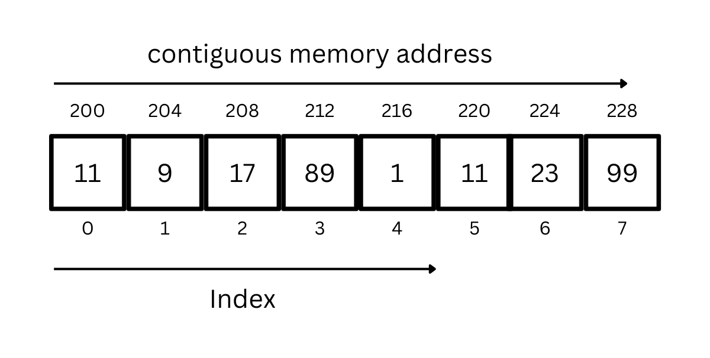

---

## Listas

- Colección de elementos ordenados.
  - Cada elemento es una unidad básica de información.
  - Posición: Lugar que ocupa un elemento en la lista.
- Tamaño es dinámico.

```java
interface List {
    int get_at(int i); // obtener elemento en posición i
    void insert_at(int i, int e); // agregar elemento en posición i
    int delete_at(int i); // remover elemento en posición i
    ...
    void insert_at_end(int e); // agregar elemento al final
    void insert_at_start(int e); // agregar elemento al inicio
    int delete_at_end(); // remover elemento al final
    int delete_at_start(); // remover elemento al inicio
}
```

---


# Listas enlazadas

Consiste en una secuencia de nodos, en los que se guardan campos de datos arbitrarios y una o dos referencias, enlaces o punteros al nodo anterior o posterior

---

## Nodo

- <small>Estructura básica utilizada en la construcción de la mayoría de las estructuras de datos</small>
- <small>Está compuesto por los datos que almacena y una lista de referencias a otros nodos</small>
   - <small>En el caso de las listas (básicas), pilas y colas solo contiene una referencia</small>
   - <small>En el caso de los árboles contiene dos o más referencias</small>

<small>

```java
class Node {
  int data;
  Node next;
  public Node(int data) {
    this.data = data;
    this.next = null;
  }
  public int getData() { return data; }
  public void setData(int data) { this.data = data; }
  public Node getNext() { return next; }
  public void setNext(Node next) { this.next = next; }
}
```

</small>

---

## Lista enlazada

- <small>Lista de nodos enlazados</small>
- <small>El último nodo apunta a `null`</small>
- <small>El primer nodo se llama `head`</small>

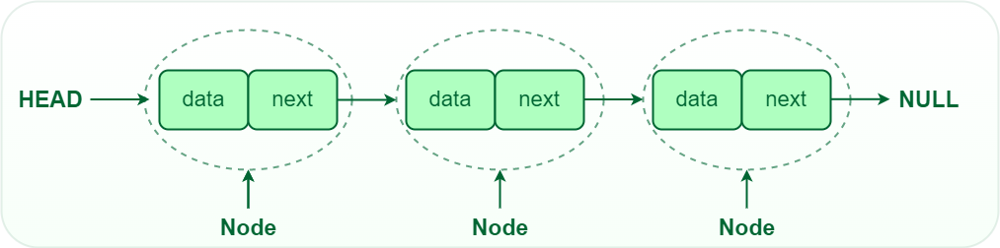

---


## Lista enlazada

```java
class LinkedList {
  Node head;
  public LinkedList() {
    this.head = null;
  }
  public int get_at(int i) {
    Node current = head;
    for (int j = 0; j < i; j++) {
      current = current.next;
    }
    return current.data;
  }
  ...
}
```

---

```java
class LinkedList {
  ...
    public void insert_at(int i, int e) {
    Node newNode = new Node(e);
    if (i == 0) {
      newNode.next = head;
      head = newNode;
    } else {
      Node current = head;
      for (int j = 0; j < i - 1; j++) {
        current = current.next;
      }
      newNode.next = current.next;
      current.next = newNode;
    }
  }
  ...
}

```


---

## Lista enlazada

```java
class LinkedList {
  ...
  public int delete_at(int i) {
    if (i == 0) {
      int data = head.data;
      head = head.next;
      return data;
    } else {
      Node current = head;
      for (int j = 0; j < i - 1; j++) {
        current = current.next;
      }
      int data = current.next.data;
      current.next = current.next.next;
      return data;
    }
  }
}
```

---

## Array vs lista enlazada


---

## Lista enlazada con tail

- <small>Lista enlazada con referencia al último nodo</small>
- <small>El último nodo se llama `tail`</small>

<small>

```java
class LinkedListWithTail {
  Node head;
  Node tail;
  public LinkedList() {
    this.head = null;
    this.tail = null;
  }
  public void insert_at_end(int e) {
    Node newNode = new Node(e);
    if (head == null) {
      head = newNode;
      tail = newNode;
    } else {
      tail.next = newNode;
      tail = newNode;
    }
  }
}
```
</small>

---

## Lista enlazada

```java
class LinkedList {
  Node head;
  public LinkedList() {
    this.head = null;
  }
  public int get_at(int i) {
    Node current = head;
    for (int j = 0; j < i; j++) {
      current = current.next;
    }
    return current.data;
  }
  ...
}
```

---

```java
class LinkedList {
  ...
    public void insert_at(int i, int e) {
    Node newNode = new Node(e);
    if (i == 0) {
      newNode.next = head;
      head = newNode;
    } else {
      Node current = head;
      for (int j = 0; j < i - 1; j++) {
        current = current.next;
      }
      newNode.next = current.next;
      current.next = newNode;
    }
  }
  ...
}

```


---

## Lista enlazada

```java
class LinkedList {
  ...
  public int delete_at(int i) {
    if (i == 0) {
      int data = head.data;
      head = head.next;
      return data;
    } else {
      Node current = head;
      for (int j = 0; j < i - 1; j++) {
        current = current.next;
      }
      int data = current.next.data;
      current.next = current.next.next;
      return data;
    }
  }
}
```

---

## Array vs lista enlazada


---

## Lista enlazada con tail

- <small>Lista enlazada con referencia al último nodo</small>
- <small>El último nodo se llama `tail`</small>

<small>

```java
class LinkedListWithTail {
  Node head;
  Node tail;
  public LinkedList() {
    this.head = null;
    this.tail = null;
  }
  public void insert_at_end(int e) {
    Node newNode = new Node(e);
    if (head == null) {
      head = newNode;
      tail = newNode;
    } else {
      tail.next = newNode;
      tail = newNode;
    }
  }
}
```

</small>

---

## LinkedList en la stdlib de java

- `add(int index, E e)` Inserta un elemento en una determinada posición
- `addFirst(E e)`	Agrega un elemento al principio de la lista
- `addLast(E e)`	Agrega un elemento al final de la lista
- `remove(int index)` Elimina un elemento en una determinada posición
- `removeFirst()`	Elimina el elemento al principio de la lista
- `removeLast()`	Elimina el elemento al final de la lista
- `get(int index)` Obtiene el elemento en una determinada posición
- `getFirst()`	Obtiene el elemento al principio de la lista
- `getLast()`	Obtiene el elemento al final de la lista


---


<a href="https://onecompiler.com/embed/java/42r347rgd?theme=dark">
<iframe
 frameBorder="0"
 height="450px"  
 src="https://onecompiler.com/embed/java/42r347rgd?theme=dark" 
 width="100%"
 >
 </iframe>
 </a>


---


## Pilas y colas
- **pila**: El único elemento accesible es el ultimo añadido.
- **cola**: El único elemento accesible es el que se añadió más temprano.
- Menos posibilidades de operaciones que una lista pero más eficientes.

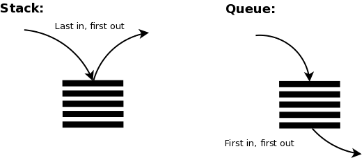


---

## Pila (stack)

<small>

- **LIFO**: Last In First Out
- Los elementos son guardados en el orden de inserción
  - No solemos pensar en la posición de los elementos, solo en el último añadido.
- El "cliente" solo puede acceder al último elemento añadido.

<hr />

- Operaciones básicas:
  - push: añadir un elemento
  - pop: quitar el último elemento añadido
  - peek (o top): ver el último elemento añadido

</small>


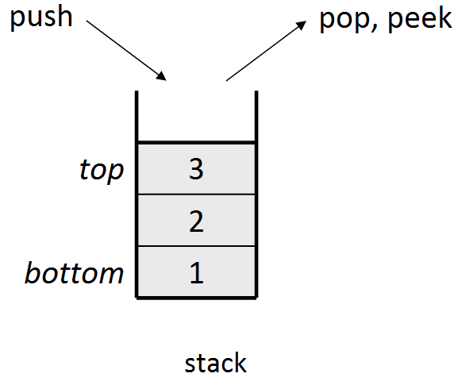

---

## Pila (stack)


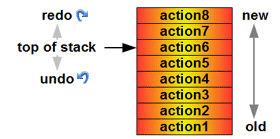
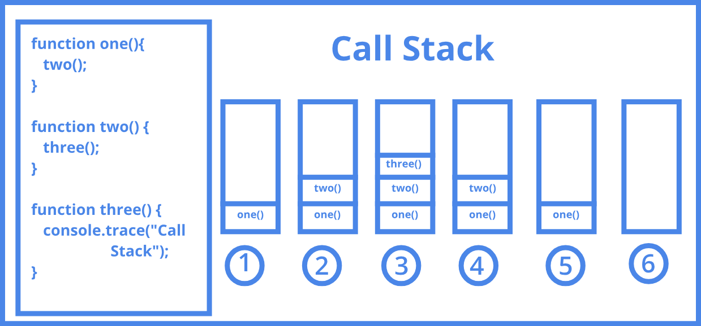

---
## [Class Stack](https://docs.oracle.com/javase/8/docs/api/java/util/Stack.html)

`java.util.Stack`

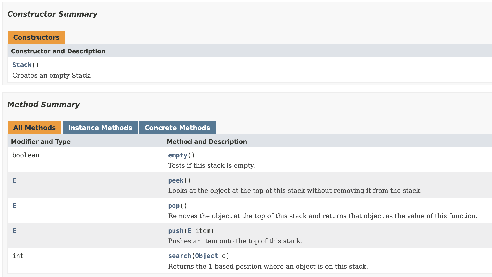

---

## Class stack

<a href="https://onecompiler.com/embed/java/428jybu4h?theme=dark">
<iframe
 frameBorder="0"
 height="450px"  
 src="https://onecompiler.com/embed/java/428jybu4h?theme=dark" 
 width="100%"
 >
</iframe>
</a>

---


- Para iterar sobre una pila se usa un bucle `while` para vaciarla.

```java
  while (!stack.isEmpty()) {
    System.out.println(stack.pop());
  }
```

---

[https://visualgo.net/en/stack](https://visualgo.net/en/stack)

<iframe
 frameBorder="0"
 height="450px"  
 src="https://visualgo.net/en/stack" 
 width="100%"
 >
</iframe>

---

```java
class Stack {
  class Node {
    int data;
    Node next;
    public Node(int data) {
      this.data = data;
      this.next = null;
    }
  }
  Node head;
  public Stack() { this.head = null; }
  public void push(int e) {
    Node newNode = new Node(e);
    if (head != null) {
      newNode.next = head;
    }
    head = newNode;
  }
  public int pop() {
    int e = head.data;
    head = head.next;
    return e;
  }
  public int peek() { return head.data; }
}
```

---

## Complejidad de las operaciones de una pila:

- `push`: O(1)
- `pop`: O(1)
- `peek`: O(1)

---


## Cola (queue)

<small>

- **FIFO**: First In First Out
- Los elementos son guardados en el orden de inserción y no suelen tener indices.
- El "cliente" puede añadir elementos al final y examinar/quitar elementos del principio.

<hr />

- Operaciones básicas:
  - enqueue: añadir un elemento al final
  - dequeue: quitar el elemento del principio
  - peek: ver el elemento del principio

</small>


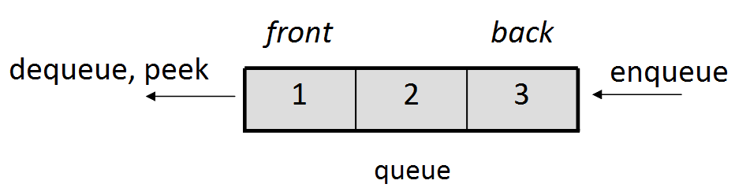

---

## Cola (queue)


---

## [Interface Queue](https://docs.oracle.com/javase/8/docs/api/java/util/Queue.html)

`java.util.Queue`


---

## Class stack

<a href="https://onecompiler.com/embed/java/42ra35uyt?theme=dark">
<iframe
 frameBorder="0"
 height="450px"  
 width="100%"
 >
</iframe>
</a>

---
[https://visualgo.net/en/queue](https://visualgo.net/en/queue)

<iframe
 frameBorder="0"
 height="450px"  
 src="https://visualgo.net/en/queue" 
 width="100%"
 >
</iframe>

---

```java
class Queue {
  class Node {
    int data;
    Node next;
    public Node(int data) {
      this.data = data;
      this.next = null;
    }
  }
  Node head, tail;
  public Queue() {
    this.head = this.tail = null;
  }
  public void enqueue(int e) {
    Node newNode = new Node(e);
    if (head == null) {
      head = tail = newNode;
    } else {
      tail.next = newNode;
      tail = newNode;
    }
  }
  public int dequeue() {
    int e = head.data;
    head = head.next;
    return e;
  }
  public int peek() {
    return head.data;
  }
}

```

---

## Complejidad de las operaciones de una cola:

- `enqueue`: O(1)
- `dequeue`: O(1)
- `peek`: O(1)

---

## Ejercicios
- List
  - [Reverse a doubly linked list (easy)](https://leetcode.com/problems/reverse-linked-list/description/)
  - [Cycle Detection (medium)](https://leetcode.com/problems/linked-list-cycle/description/)
  - [Add two numbers](https://leetcode.com/problems/add-two-numbers/description/)
- Stack
  - [Stack using two queues (medium)](https://leetcode.com/problems/implement-stack-using-queues/description/)
  - [Balanced brackets (medium)](https://leetcode.com/problems/valid-parentheses/description/)
- Queue
  - [Queue using two stacks (medium)](https://leetcode.com/problems/implement-queue-using-stacks/description/)
