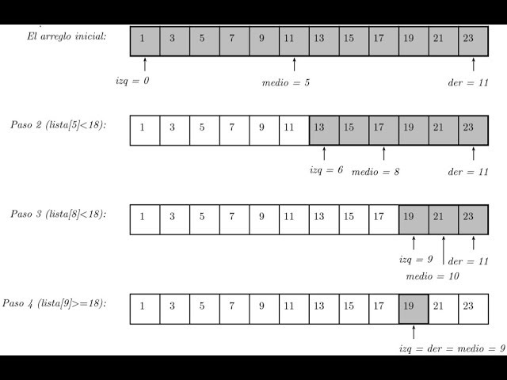
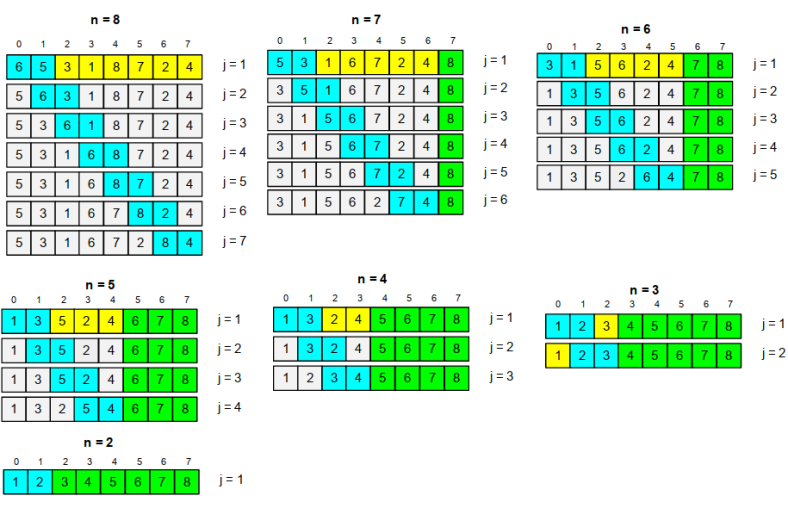
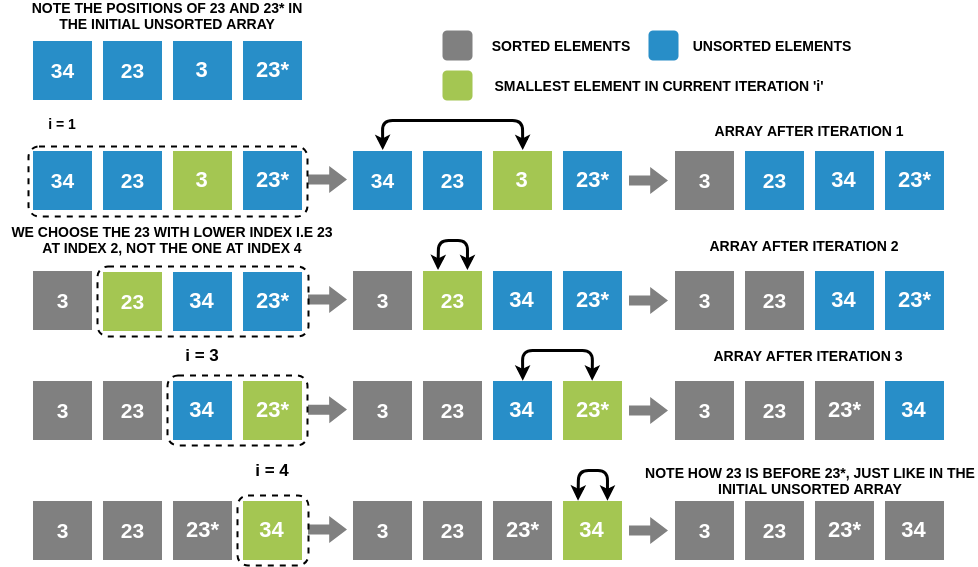
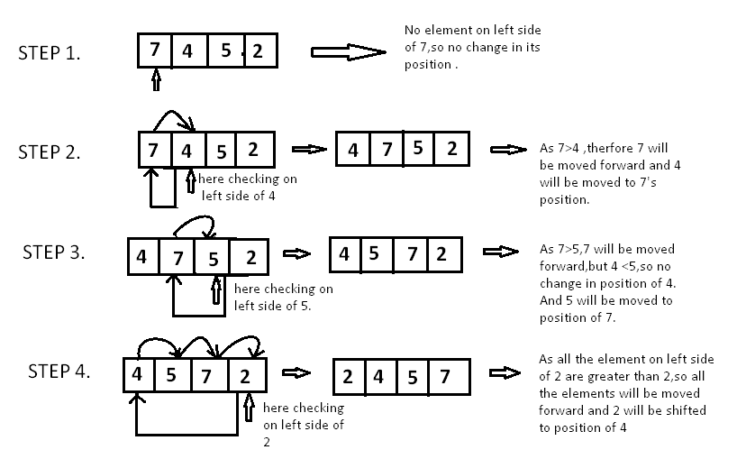
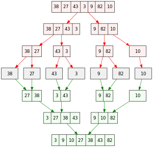

---

marp: true
theme: default
class: invert
paginate: true
author: Rodrigo Alvarez
lang: es-CL
transition: slide
footer: Búsqueda y ordenamiento
math: mathjax
style: |
  /* Define the style of "morph" class */
  .morph {
    display: inline-block;
    view-transition-name: var(--morph-name);
    contain: layout;
    vertical-align: top;
    font-size: 60px;
  }

---

# Estructura de datos y algoritmos

Rodrigo Alvarez
rodrigo.alvarez2@mail.udp.cl


---


## Búsqueda secuencial en **arreglo ordenado**:

```java
static int busquedaSecuencial(int[] arr, int x) {
    for (int i = 0; i < arr.length; i++) {
        if (arr[i] == x) {
            return i;
        } else if (arr[i] > x) {
            return -1;
        }
    }
    return -1;
}
```

---

## Búsqueda secuencial en **arreglo ordenado**:

- Si el arreglo está ordenado, se puede detener la búsqueda cuando se encuentra un elemento mayor al buscado.
- Complejidad: $O(n)$
- En el peor caso, se recorre todo el arreglo.
- En el mejor caso, se encuentra el elemento en la primera posición.

---

## Búsqueda binaria

- La búsqueda binaria es un algoritmo de búsqueda eficiente.
- Requiere que el arreglo esté ordenado.

---

## Búsqueda binaria

```java
static int busquedaBinaria(int[] arr, int x) {
    int inicio = 0;
    int fin = arr.length - 1;
    while (inicio <= fin) {
        int medio = (inicio + fin) / 2;
        if (arr[medio] == x) {
            return medio;
        } else if (arr[medio] < x) {
            inicio = medio + 1;
        } else {
            fin = medio - 1;
        }
    }
    return -1;
}
```

---

## Búsqueda binaria

- En cada paso, se reduce el tamaño del arreglo a la mitad.
- En el peor caso, se recorre el arreglo hasta que el tamaño sea 1.
- Complejidad: $O(\log{n})$




---

# Ordenamiento

---

## Bogo sort

- Bogo sort es un algoritmo de ordenamiento muy ineficiente.
- Consiste en mezclar aleatoriamente los elementos del arreglo y verificar si está ordenado.
- Si no está ordenado, se repite el proceso.
- En el peor caso el número de comparaciones e intercambios no está acotada. Es decir, no hay certeza de que el algoritmo termine.

```java
static void bogoSort(int[] arr) {
    while (!isSorted(arr)) {
        shuffle(arr);
    }
}
```

---

## Bubble sort

- Consiste en comparar pares de elementos adyacentes y cambiarlos si están en el orden incorrecto.
- Se repite el proceso hasta que no se realicen intercambios.


---

<!-- transition: fade -->

<span class="morph" style="--morph-name:b7;">███████ 7</span> 
<span class="morph" style="--morph-name:b5;">█████ 5</span>
<span class="morph" style="--morph-name:b3;">███ 3</span> 
<span class="morph" style="--morph-name:b9;">█████████ 9</span>

---

<span class="morph" style="--morph-name:b5;">█████ 5</span> 
<span class="morph" style="--morph-name:b7;">███████ 7</span>
<span class="morph" style="--morph-name:b3;">███ 3</span>
<span class="morph" style="--morph-name:b9;">█████████ 9</span>

---

<span class="morph" style="--morph-name:b5;">█████ 5</span> 
<span class="morph" style="--morph-name:b3;">███ 3</span>
<span class="morph" style="--morph-name:b7;">███████ 7</span>
<span class="morph" style="--morph-name:b9;">█████████ 9</span>

---

<span class="morph" style="--morph-name:b3;">███ 3</span>
<span class="morph" style="--morph-name:b5;">█████ 5</span> 
<span class="morph" style="--morph-name:b7;">███████ 7</span>
<span class="morph" style="--morph-name:b9;">█████████ 9</span>

<!--transition: slide -->
---

## Bubble sort


```java
static void bubbleSort(int[] arr) {
    for (int i = 0; i < arr.length - 1; i++) {
        for (int j = 0; j < arr.length - i - 1; j++) {
            if (arr[j] > arr[j + 1]) {
                int temp = arr[j];
                arr[j] = arr[j + 1];
                arr[j + 1] = temp;
            }
        }
    }
}
```
- En cada iteración, el elemento más grande se coloca en la última posición.
- Complejidad: $O(n^2)$

---

## Selection sort

- Selection sort es un algoritmo de ordenamiento simple.
- Consiste en seleccionar el elemento más pequeño y colocarlo en la primera posición.
- Luego, seleccionar el segundo elemento más pequeño y colocarlo en la segunda posición, y así sucesivamente.




---

<!-- transition: fade -->

<span class="morph" style="--morph-name:b5;">█████ 5</span>
<span class="morph" style="--morph-name:b9;">█████████ 9</span>
<span class="morph" style="--morph-name:b3;">███ 3</span> 
<span class="morph" style="--morph-name:b7;">███████ 7</span> 

---

<span class="morph" style="--morph-name:b3;">███ 3</span>
<span class="morph" style="--morph-name:b9;">█████████ 9</span>
<span class="morph" style="--morph-name:b5;">█████ 5</span>
<span class="morph" style="--morph-name:b7;">███████ 7</span>

---

<span class="morph" style="--morph-name:b3;">███ 3</span>
<span class="morph" style="--morph-name:b5;">█████ 5</span>
<span class="morph" style="--morph-name:b9;">█████████ 9</span>
<span class="morph" style="--morph-name:b7;">███████ 7</span>

---

<span class="morph" style="--morph-name:b3;">███ 3</span>
<span class="morph" style="--morph-name:b5;">█████ 5</span>
<span class="morph" style="--morph-name:b7;">███████ 7</span>
<span class="morph" style="--morph-name:b9;">█████████ 9</span>

<!--transition: slide -->
---

## Selection sort


```java
static void selectionSort(int[] arr) {
    for (int i = 0; i < arr.length - 1; i++) {
        int minIndex = i;
        for (int j = i + 1; j < arr.length; j++) {
            if (arr[j] < arr[minIndex]) {
                minIndex = j;
            }
        }
        int temp = arr[i];
        arr[i] = arr[minIndex];
        arr[minIndex] = temp;
    }
}
```

- En cada iteración, se selecciona el elemento más pequeño y se coloca en la posición correcta.
- Complejidad: $O(n^2)$

---

## Insertion sort

- Consiste en insertar un elemento en la posición correcta.
- Se recorre el arreglo de izquierda a derecha, y en cada paso se inserta el elemento en la posición correcta.



---

<!-- transition: fade -->

<span class="morph" style="--morph-name:b5;">█████ 5</span>
<span class="morph" style="--morph-name:b3;">███ 3</span>
<span class="morph" style="--morph-name:b9;">█████████ 9</span>
<span class="morph" style="--morph-name:b7;">███████ 7</span>

---

<span class="morph" style="--morph-name:b3;">███ 3</span>
<span class="morph" style="--morph-name:b5;">█████ 5</span>
<span class="morph" style="--morph-name:b9;">█████████ 9</span>
<span class="morph" style="--morph-name:b7;">███████ 7</span>

---

<span class="morph" style="--morph-name:b3;">███ 3</span>
<span class="morph" style="--morph-name:b5;">█████ 5</span>
<span class="morph" style="--morph-name:b7;">███████ 7</span>
<span class="morph" style="--morph-name:b9;">█████████ 9</span>

<!--transition: slide -->

---

## Insertion sort


```java
static void insertionSort(int[] arr) {
    for (int i = 1; i < arr.length; i++) {
        int key = arr[i];
        int j = i - 1;
        while (j >= 0 && arr[j] > key) {
            arr[j + 1] = arr[j];
            j--;
        }
        arr[j + 1] = key;
    }
}
```

- En cada iteración, se inserta un elemento en la posición correcta.
- Complejidad: $O(n^2)$

---

- [Getting Sorted & Big O Notation](https://youtu.be/kgBjXUE_Nwc?si=D_D6KUDEnkD5PjAW)
- [Insertion sort](https://youtu.be/6GU6AGEWYJY?si=INKSluUxfLvI4kGV)
- [Selection sort](https://youtu.be/Myy-eU-SWbE?si=SohMcwPUrPIzCDKD)
- [Bubble sort](https://youtu.be/pqZ04TT15PQ?si=GibKmXJIJ--Vpj5c)

---

## Divide y vencerás

- **Divide y vencerás** es un paradigma de diseño de algoritmos.
- Consiste en dividir un problema en subproblemas más pequeños.
- Resolver los subproblemas de forma recursiva.
- Combinar las soluciones de los subproblemas para resolver el problema original.

---

## Merge sort

- **Merge sort** consiste en dividir la lista en dos mitades recursivamente.
- El caso base es una lista de un elemento.
- Luego se van combinando las dos listas ordenadas hasta obtener la lista ordenada completa.
- Complejidad: $O(n \log n)$


---

## Merge sort

<small>

```java
public static int[] mergeSort(int[] arr) {
    if (arr.length <= 1) return arr;
    int mid = arr.length / 2;
    int[] left = mergeSort(Arrays.copyOfRange(arr, 0, mid));
    int[] right = mergeSort(Arrays.copyOfRange(arr, mid, arr.length));
    int i = 0, j = 0, k = 0;
    while (i < left.length && j < right.length) {
        if (left[i] < right[j]) {
            arr[k++] = left[i++];
        } else {
            arr[k++] = right[j++];
        }
    }
    while (i < left.length) {
        arr[k++] = left[i++];
    }
    while (j < right.length) {
        arr[k++] = right[j++];
    }
    return arr;
}
```

</small>


---

<!-- transition: fade -->

<span class="morph" style="--morph-name:b5;">█████ 5</span>
<span class="morph" style="--morph-name:b3;">███ 3</span>
<span class="morph" style="--morph-name:b9;">█████████ 9</span>
<span class="morph" style="--morph-name:b7;">███████ 7</span>

---

<!-- Dividiendo la lista -->
<span class="morph" style="--morph-name:b5;">█████ 5</span>
<span class="morph" style="--morph-name:b3;">███ 3</span>

<br/>

<span class="morph" style="--morph-name:b9;">█████████ 9</span>
<span class="morph" style="--morph-name:b7;">███████ 7</span>

---

<!-- Dividiendo más -->
<span class="morph" style="--morph-name:b5;">█████ 5</span>

<br />

<span class="morph" style="--morph-name:b3;">███ 3</span>

<br />

<span class="morph" style="--morph-name:b9;">█████████ 9</span>

<br />

<span class="morph" style="--morph-name:b7;">███████ 7</span>

---

<!-- Comenzando a fusionar -->
<span class="morph" style="--morph-name:b3;">███ 3</span>
<span class="morph" style="--morph-name:b5;">█████ 5</span>

<br />

<span class="morph" style="--morph-name:b7;">███████ 7</span>
<span class="morph" style="--morph-name:b9;">█████████ 9</span>

---

<!-- Fusion final -->
<span class="morph" style="--morph-name:b3;">███ 3</span>
<span class="morph" style="--morph-name:b5;">█████ 5</span>
<span class="morph" style="--morph-name:b7;">███████ 7</span>
<span class="morph" style="--morph-name:b9;">█████████ 9</span>

<!-- transition: slide -->


<!--  -->