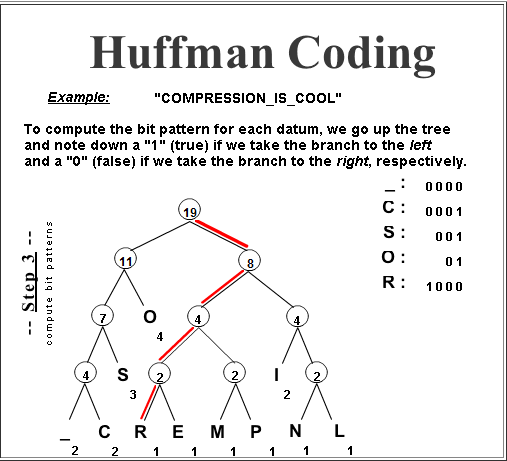

---

marp: true
theme: default
class: invert
paginate: true
author: Rodrigo Alvarez
lang: es-CL
transition: slide
footer: Priority Queue y Heap
math: mathjax

---

# Estructura de datos y algoritmos

Rodrigo Alvarez
rodrigo.alvarez2@mail.udp.cl

---

## Priority Queue

- Una cola de prioridad es un tipo de dato abstracto que permite almacenar elementos con una prioridad asociada.
- Tiene tres operaciones básicas:
  - **Insertar (add)**: Insertar un elemento con una prioridad asociada.
  - **Eliminar (poll)**: Eliminar y retornar el elemento con mayor prioridad.
  - **Mirar (peek)**: Mirar el elemento con mayor prioridad.


---

## Priority Queue

- Ejemplos de uso:

  - Algoritmos de planificación (Scheduling): se utiliza en sistemas operativos para manejar la prioridad de tareas en la planificación de CPU.
  - Algoritmos de búsqueda de caminos (Pathfinding): en el algoritmo de Dijkstra.
  - Algoritmos de compresión: algoritmo de Huffman para la compresión de datos.
  



---


<a href="https://onecompiler.com/embed/java/42epyjru6?theme=dark">
<iframe
 frameBorder="0"
 height="450px"  
 src="https://onecompiler.com/embed/java/42epyjru6?theme=dark" 
 width="100%"
 >
</iframe>
</a>

---

## Heap

- Un heap es un árbol binario completo que cumple con la propiedad de heap.
- Un heap puede ser de dos tipos:
  - **Min heap**: El valor de cada nodo es menor o igual que el valor de sus hijos.
  - **Max heap**: El valor de cada nodo es mayor o igual que el valor de sus hijos.
  - En ambos casos, el nodo raíz tiene el valor más pequeño o más grande, respectivamente.
  - Es decir la raíz de un heap es el elemento con mayor prioridad.

---

## Heap


---

## Heap

- Un heap a pesar de ser un árbol binario, se puede representar como un arreglo.
- La relación entre los índices de los nodos y sus padres e hijos es la siguiente:
  - El hijo izquierdo de un nodo en la posición $i$ está en la posición $2i + 1$.
  - El hijo derecho de un nodo en la posición $i$ está en la posición $2i + 2$.
  - El padre de un nodo en la posición $i$ está en la posición $\left\lfloor \frac{i-1}{2} \right\rfloor$.
- Esta representación permite realizar operaciones de inserción y eliminación en tiempo logarítmico.
- La altura de un heap es $O(\log n)$, donde $n$ es la cantidad de elementos.

---

## Heap

 - left: $2i + 1$
 - right: $2i + 2$
 - parent: $\left\lfloor \frac{i-1}{2} \right\rfloor$


---

```java
class MaxHeap {
  int[] heap;
  int size;
  MaxHeap(int capacity) {
    heap = new int[capacity];
    size = 0;
  }
}
```

---

## Heap: Reheapify
 - Para poder mantener las invariantes del Heap, cada vez que este es modificado por una inserción o eliminación, es necesario recuperar el orden del heap, tambien llamado “reheapify” 
 - Existen dos casos cuando es necesario esta operación:
   - Cuando se inserta un elemento en un heap y su valor es mayor que el de su padre: 
     - Se realiza un “bottom-up heapify” o "swim up".
   - Cuando se hace eliminamos el nodo raiz y se reemplaza por el último elemento del heap:
     - Se realiza un “top-down heapify” o "sink down".

---

## Heap: insertar


<small style="font-size:20px;">

- Para insertar un elemento en un heap, se agrega el elemento al final del arreglo y se realiza un reheapify hacia arriba.
- En un max heap, se compara el elemento con su padre y si es mayor, se intercambian.
- En un min heap, se compara el elemento con su padre y si es menor, se intercambian.
- Se repite el proceso hasta que el elemento llegue a la raíz o su padre sea mayor o menor, según sea el caso.
- La complejidad de esta operación es $O(\log n)$.

</small>


---

```java
  ...
  void swap(int i, int j) {
    int temp = heap[i];
    heap[i] = heap[j];
    heap[j] = temp;
  }
  void insert(int value) {
    heap[size] = value;
    swim(size);
    size++;
  }
  void swim(int index) {
    int parent = (index - 1) / 2;
    while (index > 0 && arr[index] > arr[parent]) {
      swap(index, parent);
      index = parent;
      parent = (index - 1) / 2;
    }
  }
```


---

## Heap: eliminar

<small style="font-size:20px;">

- Para eliminar un elemento en un heap, se elimina el nodo raíz y se reemplaza por el último elemento del arreglo y se realiza un reheapify hacia abajo.
- En un max heap, se compara el elemento con sus hijos y se intercambia con el mayor.
- En un min heap, se compara el elemento con sus hijos y se intercambia con el menor.
- Se repite el proceso hasta que el elemento llegue a una hoja o sus hijos sean menores o mayores, según sea el caso.
- La complejidad de esta operación es $O(\log n)$.

</small>


---

```java
  ...
  void remove() {
    heap[0] = heap[size-1];
    size--;
    sink(0);
  }
  void sink(int index) {
    while (2 * index + 1 < size) {
      int left = 2 * index + 1;
      int right = 2 * index + 2;
      int largest = left;
      if (right < size && arr[right] > arr[left]) {
        largest = right;
      }
      if (arr[index] >= arr[largest]) {
        break;
      }
      swap(index, largest);
      index = largest;
    }

  }
```

---

[https://visualgo.net/en/heap](https://visualgo.net/en/heap)

<iframe
 frameBorder="0"
 height="450px"  
 src="https://visualgo.net/en/heap" 
 width="100%"
 >
</iframe>

---

## Heap sort

- Heap sort es un algoritmo de ordenamiento basado en la estructura de un heap.
- La idea es construir un heap a partir de los elementos y luego ir eliminando el nodo raíz y reemplazándolo por el último elemento del heap.
- La complejidad de este algoritmo es $O(n \log n)$ en el peor caso.
- A pesar de tener la misma complejidad que quicksort y mergesort, heap sort es menos eficiente en la práctica.
- Sin embargo, heap sort es un algoritmo in-place y no necesita memoria adicional.

---

 - [heap](https://www.youtube.com/watch?v=t0Cq6tVNRBA&pp=ugMICgJlcxABGAHKBQRoZWFw)
 - [implementación heap](https://youtu.be/pAU21g-jBiE?si=5p7EeEGtMyPQ2gz5)
 - [clase heap mit](https://youtu.be/Xnpo1atN-Iw?si=rKx006znbmC4q6ea)