---

marp: true
theme: default
class: invert
paginate: true
author: Rodrigo Alvarez
lang: es-CL
transition: slide
footer: Set y Map
math: mathjax

---

# Estructura de datos y algoritmos

Rodrigo Alvarez
rodrigo.alvarez2@mail.udp.cl

---

## Set: TDA

- Un conjunto es una colección de elementos sin repetición.
- Tiene tres operaciones básicas:
  - **Insertar (add)**: Insertar un elemento.
  - **Eliminar (remove)**: Eliminar un elemento.
  - **Buscar (contains)**: Buscar un elemento.
  
---

<a href="https://onecompiler.com/embed/java/42f6baw6u?theme=dark">
  <iframe
  frameBorder="0"
  height="450px"  
  src="https://onecompiler.com/embed/java/42f6baw6u?theme=dark" 
  width="100%"
  >
  </iframe>
</a>

---

## Map: TDA

- Un mapa es una colección de pares clave-valor.
- Tiene tres operaciones básicas:
  - **Insertar (put)**: Insertar un par clave-valor.
  - **Eliminar (remove)**: Eliminar un par clave-valor.
  - **Buscar (get)**: Buscar un valor asociado a una clave.
- Ejemplos de uso:
  - Diccionarios en Python.
  - Tablas de símbolos en compiladores.

---

<a href="https://onecompiler.com/embed/java/42f6jz5pq?theme=dark">
  <iframe
  frameBorder="0"
  height="450px"  
  src="https://onecompiler.com/embed/java/42f6jz5pq?theme=dark" 
  width="100%"
  >
  </iframe>
</a>

---

## HashTable

- Es una estructura de datos que al estar bien implementada permite que la inserción, remoción y búsqueda tengan una complejidad de tiempo constante
  - Se utiliza un vector o una matriz para almacenar los datos, tamaño debe ser conocido (existen otras formas de almacenar, pero dependen de la implementación a utilizar)
  - Se utiliza una función hash, la cual asocia un elemento de un cierto conjunto (string, números, archivos, etc.) a un número entero de tamaño conocido

---

## HashTable: ejemplo

<small style="font-size:18px;">

- Deseamos guardar las ocurrencias de cada palabra en un texto
  - dia: 6
  - escuela: 13
  - gratuito: 1
  - arbol: 8
  - burro: 5 
  - feudal: 2
- Si tuvieramos solo una palabra que comienza con cada letra podríamos construir una estructura que contenga un vector con 26 posiciones y una función hash de tipo:
  ```java
  int hash(String s) {
    return s.charAt(0) - 'a';
  }
  ```
- De esta forma, la palabra "dia" se almacenaría en la posición 3 del vector

</small>

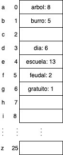

---

## HashTable: encadenamiento

<small style="font-size:20px;">

- Cómo mejoramos la tabla hash para que pueda almacenar más de una palabra que empiece con la misma letra?
- Podríamos hacer que cada posición del vector fuera una lista enlazada y en el caso de una <span style="color:red;"> colisión </span> se almacenan en la lista de esa posición
  - colisión: que dos o más llaves, obtengan el mismo resultado en a función de hash
- Este tipo de tabla hash se le llama encadenamiento

</small >

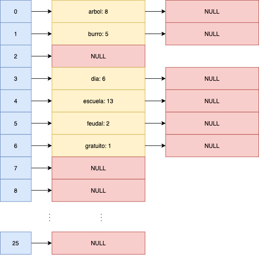

---

## HashTable: encadenamiento

- Si queremos insertar las palabras:
  - Boca: 7
  - Bola: 9
  - Bela: 1
- Nuestra estructura se comienza a asemejar a una lista enlazada común, donde el tiempo de insertar, buscar y remover comienza a tender a O(N), por lo cual debemos seguir mejorando la estructura 


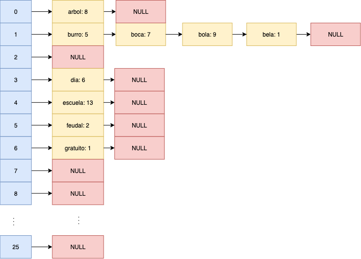

---

## HashTable: encadenamiento

- Como mejorar la dispersión para que la complejidad no se vuelva O(n)?
- Si la función hash utiliza toda la key, en vez de solo utilizar la primera letra se podrán conseguir mejores resultados

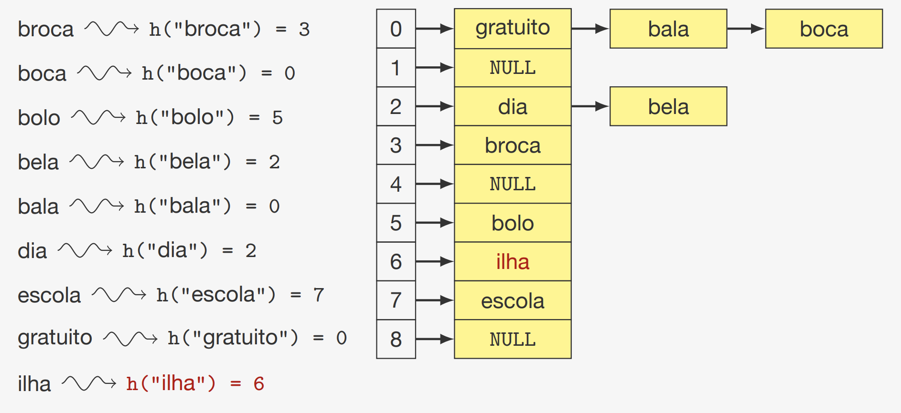

---

## HashTable: propiedades

- La complejidad de tiempo de las operaciones de inserción, búsqueda y eliminación en una tabla hash dependen de la función hash y de la forma en que se manejan las colisiones
- En el caso de encadenamiento, la complejidad de tiempo de las operaciones es O(1) en promedio, pero en el peor caso es O(n) si se elige una mala función hash

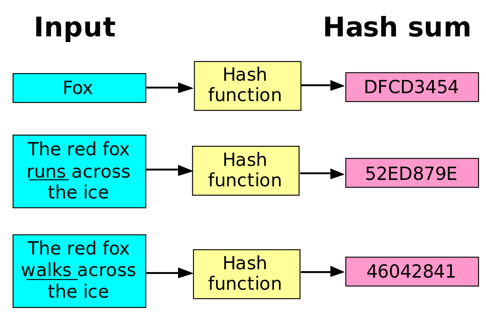

---

## Función de hashing

- Una buena función de hashing hace que las llaves están dispersas en la tabla:
  - La probabilidad de una llave de tener un hash específico es (aproximadamente) `1/M` (M es el tamaño de la tabla)
  - o sea, esperamos que cada lista tenga `n/M` elementos (n es el número de elementos)
- Hashing perfecto: si conocemos todas llaves a priori, es posible encontrar una función de hashing inyectiva:
  - eso significa que no existen colisiones
  - encontrar esa función puede ser muy difícil

---

## Función de hashing
- La función hash presupone que las llaves son <span style="color:red;"> números enteros </span>
- Que pasa si no lo es?
  - La llave es reinterpretada como un número entero
- Con este método, donde la llave es reinterpretada como una secuencia de bits, la palabra “bala” se transforma en el numero 1.650.551.905

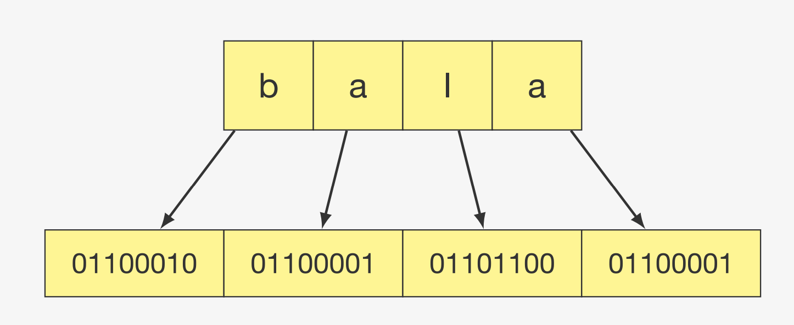


---

## Función de hashing: método de la división

- Obtenemos el resto de la división por el tamaño M del arreglo de almacenamiento
$$ h(x) = x \bmod M$$
Ejemplo:
$$ h(\textquotedblleft bala \textquotedblright) = 1.650.551.905 \bmod 1783 = 277 $$

- Este método es simple y rápido, pero puede ser ineficiente si M no es un número primo ya que las colisiones pueden ser más frecuentes
- Si M es un número primo, la probabilidad de colisión es menor

---

## Función de hashing: método de la división

- Cómo podemos calcular el número x que representa el string “bala” ?
 $$ x = \textrm`b\textrm' \cdot 256^3 + \textrm`a\textrm' \cdot 256^2 + \textrm`l\textrm' \cdot 256 + \textrm`a\textrm' \cdot 256^0$$
- Este cálculo puede ser reescrito:
  $$ x = (((\textrm`b\textrm' \cdot 256) + \textrm`a\textrm') \cdot 256 + \textrm`l\textrm') \cdot 256 + \textrm`a\textrm'$$
- El problema es que <color style="color:red;">x</color> puede ser un número tan grande que puede superar fácilmente el máximo de un int, pero el cálculo puede ser reducido utilizando álgebra modular reescribiendo la fórmula x mod M:
  <small style="font-size: 24px;">
 $$ x = ((((\textrm`b\textrm' \bmod M) \cdot 256) + (\textrm`a\textrm' \bmod M)) \cdot 256 + (\textrm`l\textrm' \bmod M)) \cdot 256 + (\textrm`a\textrm' \bmod M)$$

 </small>

---

## HashTable: implementación con encadenamiento

```java
public class HashTable {
  private static final int SIZE = 1783;
  private LinkedList<Node>[] table;

  private class Node {
    String key;
    String value;

  public Node(String key, String value) {
      this.key = key;
      this.value = value;
    }
  }

  private int hash(String key) {
    // Division method
    int hash = 0;
    for (int i = 0; i < key.length(); i++) {
      hash = (256 * hash + key.charAt(i)) % SIZE;
    }
    return hash;
  }
  ...
}
```

---

## HashTable: implementación con encadenamiento

```java
public class HashTable {
  ...
 public void put(String key, String value) {
    int index = hash(key);
    if (table[index] == null) {
      table[index] = new LinkedList<>();
    }
    table[index].add(new Node(key, value));
  }

  public String get(String key) {
    int index = hash(key);
    if (table[index] == null) {
      return null;
    }
    for (Node node : table[index]) {
      if (node.key.equals(key)) {
        return node.value;
      }
    }
    return null;
  }
  ...
}
```

---

## HashTable: implementación con encadenamiento

```java
public class HashTable {
  ...
    public void remove(String key) {
    int index = hash(key);
    if (table[index] == null) {
      return;
    }
    for (Node node : table[index]) {
      if (node.key.equals(key)) {
        table[index].remove(node);
        return;
      }
    }
  }
}

```


---

## HashTable: Linear probing

<small style="font-size:20px;">

- Existe una alternativa a la implementación de una tabla hashing encadenada
- Linear probing:
  - los datos son guardados en el mismo vector
  - las colisiones son colocadas en la siguiente posición libre de la tabla
- Características
  - Evita recorrer punteros al no utilizar listas enlazadas
  - Si la tabla se llena, es necesario crear una mayor
    - cambiar la función hash
    - recalcular todos los hash
  - La remoción se vuelve un poco más complicada
- Inserción:
  - Obtenemos la posición con la función hashing
  - Si el espacio está libre, guardamos el dato
  - Si no está libre, buscamos cual es la siguiente posición libre después de la posición obtenida de la función hashing, al encontrarla guardamos el dato en esa posición

</small>

---

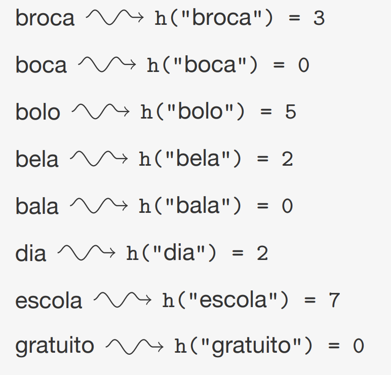
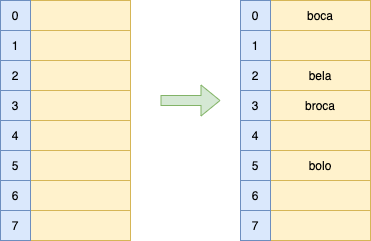

---

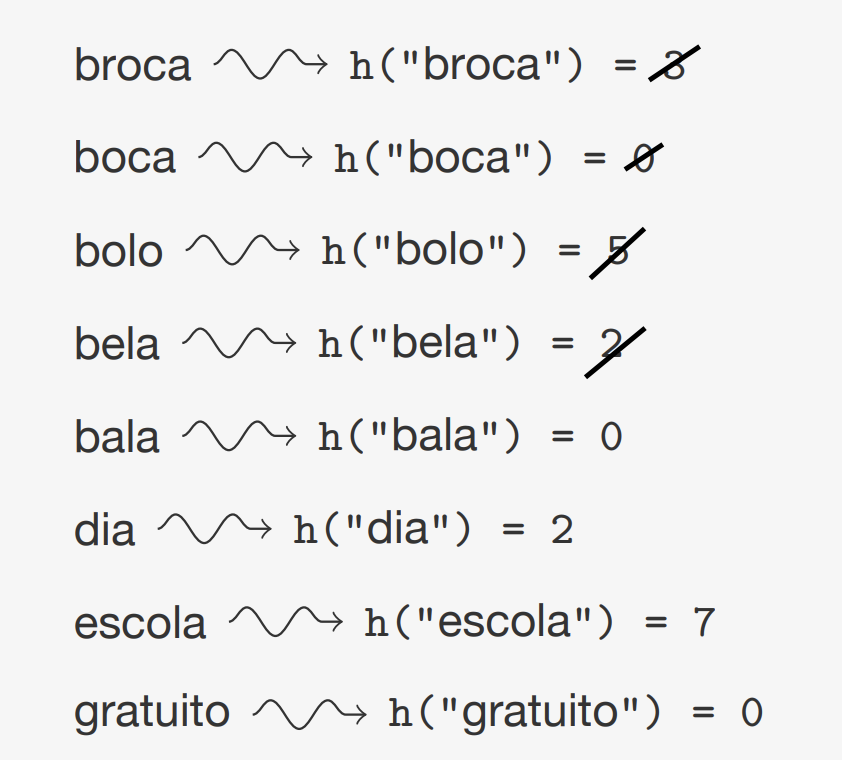
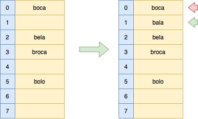

---

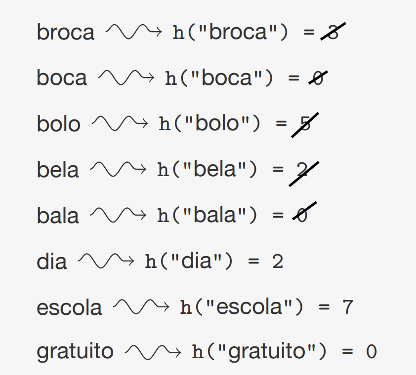
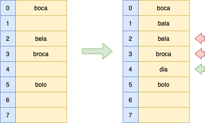

---

## HashTable: Linear probing

- Como hacer la búsqueda con linear probing?
 - Es necesario simular la inserción:
   - Calcular la función de hashing
   - Recorrer la tabla en secuencia buscando por la llave
   - Si la llave es encontrada, se retornan los items que pertenecen a la llave
   - Si se encuentra un espacio vacío (la llave no existe), se devuelve NULL


---

## HashTable: Linear probing

<small>

- Como se realiza la remoción en linear probing?
  - No se puede solo remover los elementos de la tabla, ya que se rompe la búsqueda
  - Opción 1: Hacer rehash de todos los elementos que están después del dato a remover
    - es costoso y tiene que ser implementado con cuidado
  - Opción 2: se intercambia el ítem a remover por un valor dummy indicando que el item fue removido
    - al momento de insertar un nuevo dato, ese valor dummy  es considerado como vacío, cuando se realiza la búsqueda es como si en esa posición existiera un dato.
  - Opción 3: se marca el valor como removido utilizando un campo adicional

</small>

---

## Hashing doble

- Técnica para mejorar el linear probing
- Cuando se detecta una colisión, en vez de dar un salto a la siguiente posicion en la tabla, damos un salto a la posición dada por $h(k,i)$, calculado a partir de una segunda función de hashing
$$ h(k, i) = (hash_1(k) + i \cdot hash_2(k)) \bmod M$$
- Cuidados:
  - <span style="color:red;">$hash_2(k)$</span> nunca puede ser cero
  - <span style="color:red;">$hash_1(k)$</span> tiene que ser co-primo con <span style="color:red;">M</span>
    - Eso permite que las secuencias de búsqueda sean largas y no terminen en un loop
  - <span style="color:red;">i</span> es el contador de la iteración  (cuantas veces se ha pedido este hash)

---

## Conclusiones

- Hashing es una buena estructura de datos para:
  - Insertar, remover y buscar datos por una llave rapidamente
  - Con una buena función de hashing, las operaciones tienen complejidad O(1)
  - No es una estructura de datos buena para hacer operaciones relacionadas al orden de las llaves
- Escogiendo la implementación:
  - Linear probing es más rápido que la tabla encadenada
  - Hashing doble usa mejor la memoria
    - Pero gasta más tiempo para calcular la segunda función de hash
  - El encadenamiento es más fácil de implementar
    - pero usa mas memoria

---

## Donde más se utilizan las funciones de hashing?

<small style="font-size:20px;">

- Las funciones de hash tienen muchas otras aplicaciones en la computación:
  - Para evitar los errores de transmisión, podemos, además de informar una llave, transmitir el resultado de la función de hash. Ejemplos:
    - Dígitos verificadores
    - Secuencias de verificación de archivos (MD5 o SHA)
- Guardamos el hash de una contraseña en las bases de datos en vez de guardar la contraseña misma
  - Evitamos que la información de las contraseñas sea pública en caso de un ataque malicioso

</small>

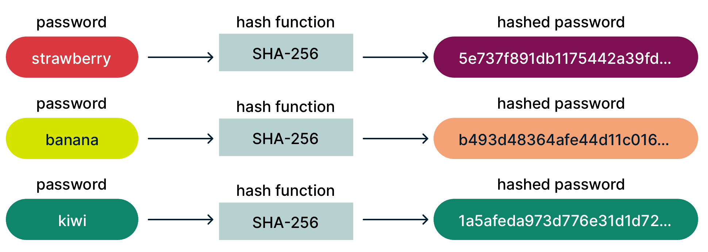

---

- [Maps, HashTables, dictionaries and collisions](https://youtu.be/kNheXzNOcm4?si=yV3gEWy4Xq5LXxPi)
- [Principio del palomar](https://youtu.be/77VWa8PjVnA?si=AN5El1KLPj33pWed)
- [Hashing algorithms](https://youtu.be/b4b8ktEV4Bg?si=Old4aRIw5UgRe9bO)