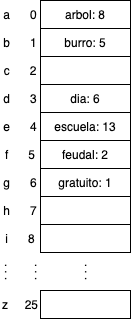
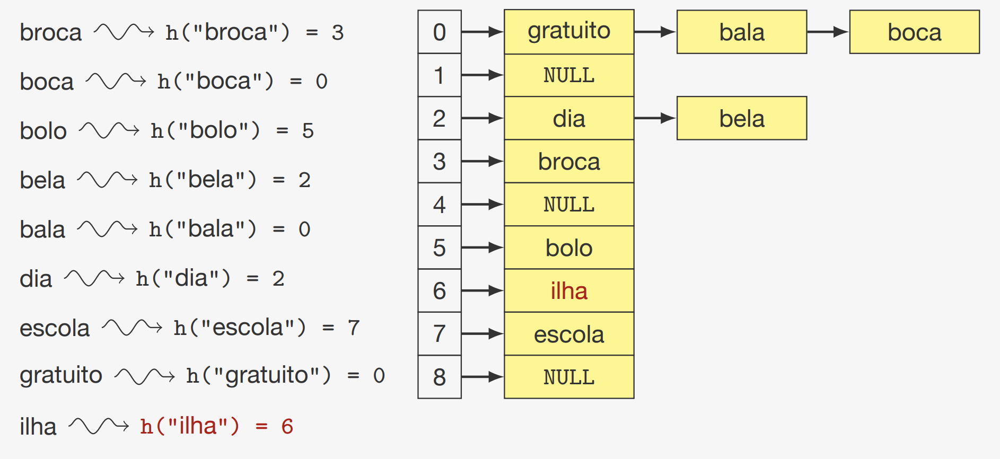
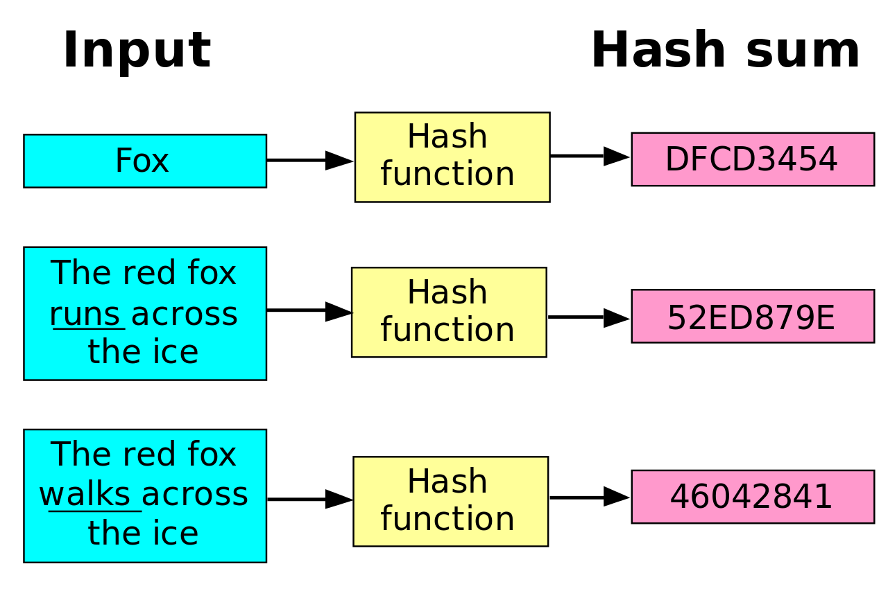
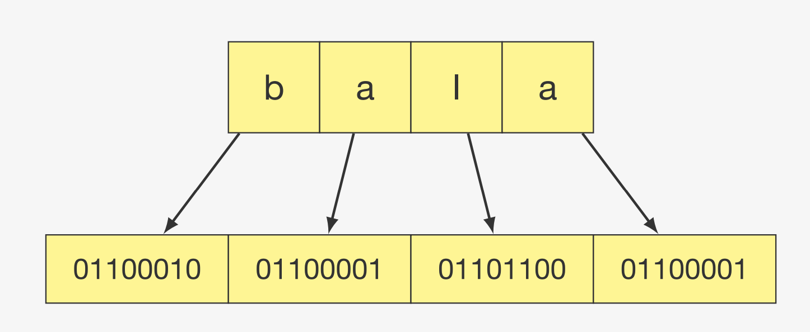
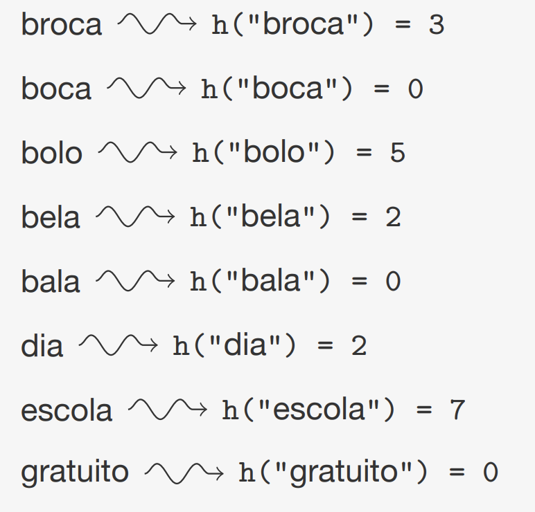
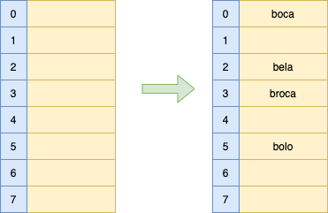
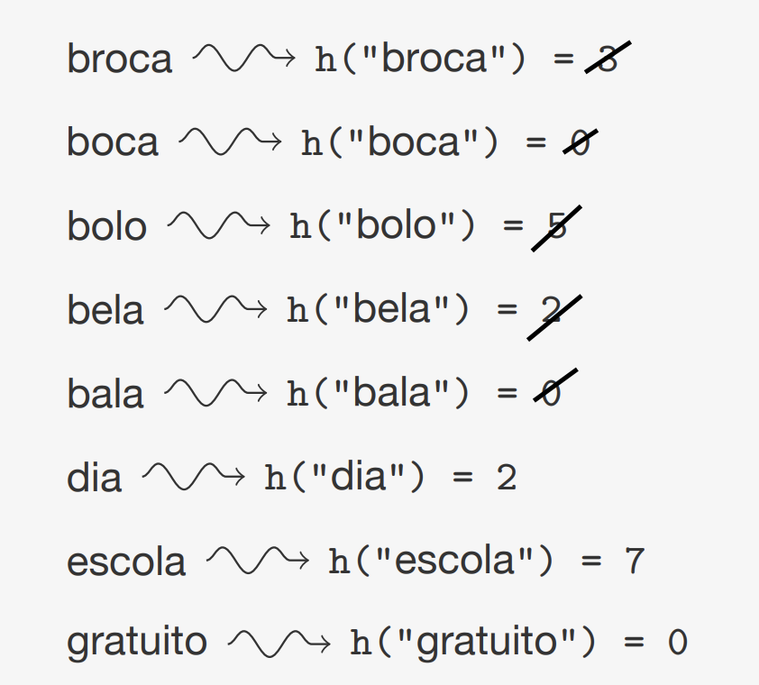

---

marp: true
theme: default
class: invert
paginate: true
author: Rodrigo Alvarez
lang: es-CL
transition: slide
footer: Repaso 2
math: mathjax

---

# Estructura de datos y algoritmos

Rodrigo Alvarez
rodrigo.alvarez2@mail.udp.cl

---

## Priority Queue

- Una cola de prioridad es un tipo de dato abstracto que permite almacenar elementos con una prioridad asociada.
- Tiene tres operaciones básicas:
  - **Insertar (add)**: Insertar un elemento con una prioridad asociada.
  - **Eliminar (poll)**: Eliminar y retornar el elemento con mayor prioridad.
  - **Mirar (peek)**: Mirar el elemento con mayor prioridad.


---

## Priority Queue

- Ejemplos de uso:

  - Algoritmos de planificación (Scheduling): se utiliza en sistemas operativos para manejar la prioridad de tareas en la planificación de CPU.
  - Algoritmos de búsqueda de caminos (Pathfinding): en el algoritmo de Dijkstra.
  - Algoritmos de compresión: algoritmo de Huffman para la compresión de datos.
  


---


<a href="https://onecompiler.com/embed/java/42epyjru6?theme=dark">
<iframe
 frameBorder="0"
 height="450px"  
 src="https://onecompiler.com/embed/java/42epyjru6?theme=dark" 
 width="100%"
 >
</iframe>
</a>

---

## Heap

- Un heap es un árbol binario completo que cumple con la propiedad de heap.
- Un heap puede ser de dos tipos:
  - **Min heap**: El valor de cada nodo es menor o igual que el valor de sus hijos.
  - **Max heap**: El valor de cada nodo es mayor o igual que el valor de sus hijos.
  - En ambos casos, el nodo raíz tiene el valor más pequeño o más grande, respectivamente.
  - Es decir la raíz de un heap es el elemento con mayor prioridad.

---

## Heap


---

## Heap

- Un heap a pesar de ser un árbol binario, se puede representar como un arreglo.
- La relación entre los índices de los nodos y sus padres e hijos es la siguiente:
  - El hijo izquierdo de un nodo en la posición $i$ está en la posición $2i + 1$.
  - El hijo derecho de un nodo en la posición $i$ está en la posición $2i + 2$.
  - El padre de un nodo en la posición $i$ está en la posición $\left\lfloor \frac{i-1}{2} \right\rfloor$.
- Esta representación permite realizar operaciones de inserción y eliminación en tiempo logarítmico.
- La altura de un heap es $O(\log n)$, donde $n$ es la cantidad de elementos.

---

## Heap

 - left: $2i + 1$
 - right: $2i + 2$
 - parent: $\left\lfloor \frac{i-1}{2} \right\rfloor$


---

```java
class MaxHeap {
  int[] heap;
  int size;
  MaxHeap(int capacity) {
    heap = new int[capacity];
    size = 0;
  }
}
```

---

## Heap: Reheapify
 - Para poder mantener las invariantes del Heap, cada vez que este es modificado por una inserción o eliminación, es necesario recuperar el orden del heap, tambien llamado “reheapify” 
 - Existen dos casos cuando es necesario esta operación:
   - Cuando se inserta un elemento en un heap y su valor es mayor que el de su padre: 
     - Se realiza un “bottom-up heapify” o "swim up".
   - Cuando se hace eliminamos el nodo raiz y se reemplaza por el último elemento del heap:
     - Se realiza un “top-down heapify” o "sink down".

---

## Heap: insertar


<small style="font-size:20px;">

- Para insertar un elemento en un heap, se agrega el elemento al final del arreglo y se realiza un reheapify hacia arriba.
- En un max heap, se compara el elemento con su padre y si es mayor, se intercambian.
- En un min heap, se compara el elemento con su padre y si es menor, se intercambian.
- Se repite el proceso hasta que el elemento llegue a la raíz o su padre sea mayor o menor, según sea el caso.
- La complejidad de esta operación es $O(\log n)$.

</small>


---

```java
  ...
  void swap(int i, int j) {
    int temp = heap[i];
    heap[i] = heap[j];
    heap[j] = temp;
  }
  void insert(int value) {
    heap[size] = value;
    swim(size);
    size++;
  }
  void swim(int index) {
    int parent = (index - 1) / 2;
    while (index > 0 && arr[index] > arr[parent]) {
      swap(index, parent);
      index = parent;
      parent = (index - 1) / 2;
    }
  }
```


---

## Heap: eliminar

<small style="font-size:20px;">

- Para eliminar un elemento en un heap, se elimina el nodo raíz y se reemplaza por el último elemento del arreglo y se realiza un reheapify hacia abajo.
- En un max heap, se compara el elemento con sus hijos y se intercambia con el mayor.
- En un min heap, se compara el elemento con sus hijos y se intercambia con el menor.
- Se repite el proceso hasta que el elemento llegue a una hoja o sus hijos sean menores o mayores, según sea el caso.
- La complejidad de esta operación es $O(\log n)$.

</small>


---

```java
  ...
  void remove() {
    heap[0] = heap[size-1];
    size--;
    sink(0);
  }
  void sink(int index) {
    while (2 * index + 1 < size) {
      int left = 2 * index + 1;
      int right = 2 * index + 2;
      int largest = left;
      if (right < size && arr[right] > arr[left]) {
        largest = right;
      }
      if (arr[index] >= arr[largest]) {
        break;
      }
      swap(index, largest);
      index = largest;
    }

  }
```

---

[https://visualgo.net/en/heap](https://visualgo.net/en/heap)

<iframe
 frameBorder="0"
 height="450px"  
 src="https://visualgo.net/en/heap" 
 width="100%"
 >
</iframe>

---

## Heap sort

- Heap sort es un algoritmo de ordenamiento basado en la estructura de un heap.
- La idea es construir un heap a partir de los elementos y luego ir eliminando el nodo raíz y reemplazándolo por el último elemento del heap.
- La complejidad de este algoritmo es $O(n \log n)$ en el peor caso.
- A pesar de tener la misma complejidad que quicksort y mergesort, heap sort es menos eficiente en la práctica.
- Sin embargo, heap sort es un algoritmo in-place y no necesita memoria adicional.

---

# Map y Set

---


## Set: TDA

- Un conjunto es una colección de elementos sin repetición.
- Tiene tres operaciones básicas:
  - **Insertar (add)**: Insertar un elemento.
  - **Eliminar (remove)**: Eliminar un elemento.
  - **Buscar (contains)**: Buscar un elemento.
  
---

<a href="https://onecompiler.com/embed/java/42f6baw6u?theme=dark">
  <iframe
  frameBorder="0"
  height="450px"  
  src="https://onecompiler.com/embed/java/42f6baw6u?theme=dark" 
  width="100%"
  >
  </iframe>
</a>

---

## Map: TDA

- Un mapa es una colección de pares clave-valor.
- Tiene tres operaciones básicas:
  - **Insertar (put)**: Insertar un par clave-valor.
  - **Eliminar (remove)**: Eliminar un par clave-valor.
  - **Buscar (get)**: Buscar un valor asociado a una clave.
- Ejemplos de uso:
  - Diccionarios en Python.
  - Tablas de símbolos en compiladores.

---

<a href="https://onecompiler.com/embed/java/42f6jz5pq?theme=dark">
  <iframe
  frameBorder="0"
  height="450px"  
  src="https://onecompiler.com/embed/java/42f6jz5pq?theme=dark" 
  width="100%"
  >
  </iframe>
</a>

---

## HashTable

- Es una estructura de datos que al estar bien implementada permite que la inserción, remoción y búsqueda tengan una complejidad de tiempo constante
  - Se utiliza un vector o una matriz para almacenar los datos, tamaño debe ser conocido (existen otras formas de almacenar, pero dependen de la implementación a utilizar)
  - Se utiliza una función hash, la cual asocia un elemento de un cierto conjunto (string, números, archivos, etc.) a un número entero de tamaño conocido

---

## HashTable: ejemplo

<small style="font-size:18px;">

- Deseamos guardar las ocurrencias de cada palabra en un texto
  - dia: 6
  - escuela: 13
  - gratuito: 1
  - arbol: 8
  - burro: 5 
  - feudal: 2
- Si tuvieramos solo una palabra que comienza con cada letra podríamos construir una estructura que contenga un vector con 26 posiciones y una función hash de tipo:
  ```java
  int hash(String s) {
    return s.charAt(0) - 'a';
  }
  ```
- De esta forma, la palabra "dia" se almacenaría en la posición 3 del vector

</small>



---

## HashTable: encadenamiento

<small style="font-size:20px;">

- Cómo mejoramos la tabla hash para que pueda almacenar más de una palabra que empiece con la misma letra?
- Podríamos hacer que cada posición del vector fuera una lista enlazada y en el caso de una <span style="color:red;"> colisión </span> se almacenan en la lista de esa posición
  - colisión: que dos o más llaves, obtengan el mismo resultado en a función de hash
- Este tipo de tabla hash se le llama encadenamiento

</small >


---

## HashTable: encadenamiento

- Si queremos insertar las palabras:
  - Boca: 7
  - Bola: 9
  - Bela: 1
- Nuestra estructura se comienza a asemejar a una lista enlazada común, donde el tiempo de insertar, buscar y remover comienza a tender a O(N), por lo cual debemos seguir mejorando la estructura 


---

## HashTable: encadenamiento

- Como mejorar la dispersión para que la complejidad no se vuelva O(n)?
- Si la función hash utiliza toda la key, en vez de solo utilizar la primera letra se podrán conseguir mejores resultados



---

## HashTable: propiedades

- La complejidad de tiempo de las operaciones de inserción, búsqueda y eliminación en una tabla hash dependen de la función hash y de la forma en que se manejan las colisiones
- En el caso de encadenamiento, la complejidad de tiempo de las operaciones es O(1) en promedio, pero en el peor caso es O(n) si se elige una mala función hash



---

## Función de hashing

- Una buena función de hashing hace que las llaves están dispersas en la tabla:
  - La probabilidad de una llave de tener un hash específico es (aproximadamente) `1/M` (M es el tamaño de la tabla)
  - o sea, esperamos que cada lista tenga `n/M` elementos (n es el número de elementos)
- Hashing perfecto: si conocemos todas llaves a priori, es posible encontrar una función de hashing inyectiva:
  - eso significa que no existen colisiones
  - encontrar esa función puede ser muy difícil

---

## Función de hashing
- La función hash presupone que las llaves son <span style="color:red;"> números enteros </span>
- Que pasa si no lo es?
  - La llave es reinterpretada como un número entero
- Con este método, donde la llave es reinterpretada como una secuencia de bits, la palabra “bala” se transforma en el numero 1.650.551.905




---

## Función de hashing: método de la división

- Obtenemos el resto de la división por el tamaño M del arreglo de almacenamiento
$$ h(x) = x \bmod M$$
Ejemplo:
$$ h(\textquotedblleft bala \textquotedblright) = 1.650.551.905 \bmod 1783 = 277 $$

- Este método es simple y rápido, pero puede ser ineficiente si M no es un número primo ya que las colisiones pueden ser más frecuentes
- Si M es un número primo, la probabilidad de colisión es menor

---

## Función de hashing: método de la división

- Cómo podemos calcular el número x que representa el string “bala” ?
 $$ x = \textrm`b\textrm' \cdot 256^3 + \textrm`a\textrm' \cdot 256^2 + \textrm`l\textrm' \cdot 256 + \textrm`a\textrm' \cdot 256^0$$
- Este cálculo puede ser reescrito:
  $$ x = (((\textrm`b\textrm' \cdot 256) + \textrm`a\textrm') \cdot 256 + \textrm`l\textrm') \cdot 256 + \textrm`a\textrm'$$
- El problema es que <color style="color:red;">x</color> puede ser un número tan grande que puede superar fácilmente el máximo de un int, pero el cálculo puede ser reducido utilizando álgebra modular reescribiendo la fórmula x mod M:
  <small style="font-size: 24px;">
 $$ x = ((((\textrm`b\textrm' \bmod M) \cdot 256) + (\textrm`a\textrm' \bmod M)) \cdot 256 + (\textrm`l\textrm' \bmod M)) \cdot 256 + (\textrm`a\textrm' \bmod M)$$

 </small>

---

## HashTable: implementación con encadenamiento

```java
public class HashTable {
  private static final int SIZE = 1783;
  private LinkedList<Node>[] table;

  private class Node {
    String key;
    String value;

  public Node(String key, String value) {
      this.key = key;
      this.value = value;
    }
  }

  private int hash(String key) {
    // Division method
    int hash = 0;
    for (int i = 0; i < key.length(); i++) {
      hash = (256 * hash + key.charAt(i)) % SIZE;
    }
    return hash;
  }
  ...
}
```

---

## HashTable: implementación con encadenamiento

```java
public class HashTable {
  ...
 public void put(String key, String value) {
    int index = hash(key);
    if (table[index] == null) {
      table[index] = new LinkedList<>();
    }
    table[index].add(new Node(key, value));
  }

  public String get(String key) {
    int index = hash(key);
    if (table[index] == null) {
      return null;
    }
    for (Node node : table[index]) {
      if (node.key.equals(key)) {
        return node.value;
      }
    }
    return null;
  }
  ...
}
```

---

## HashTable: implementación con encadenamiento

```java
public class HashTable {
  ...
    public void remove(String key) {
    int index = hash(key);
    if (table[index] == null) {
      return;
    }
    for (Node node : table[index]) {
      if (node.key.equals(key)) {
        table[index].remove(node);
        return;
      }
    }
  }
}

```


---

## HashTable: Linear probing

<small style="font-size:20px;">

- Existe una alternativa a la implementación de una tabla hashing encadenada
- Linear probing:
  - los datos son guardados en el mismo vector
  - las colisiones son colocadas en la siguiente posición libre de la tabla
- Características
  - Evita recorrer punteros al no utilizar listas enlazadas
  - Si la tabla se llena, es necesario crear una mayor
    - cambiar la función hash
    - recalcular todos los hash
  - La remoción se vuelve un poco más complicada
- Inserción:
  - Obtenemos la posición con la función hashing
  - Si el espacio está libre, guardamos el dato
  - Si no está libre, buscamos cual es la siguiente posición libre después de la posición obtenida de la función hashing, al encontrarla guardamos el dato en esa posición

</small>

---




---


---




---

## HashTable: Linear probing

- Como hacer la búsqueda con linear probing?
 - Es necesario simular la inserción:
   - Calcular la función de hashing
   - Recorrer la tabla en secuencia buscando por la llave
   - Si la llave es encontrada, se retornan los items que pertenecen a la llave
   - Si se encuentra un espacio vacío (la llave no existe), se devuelve NULL


---

[top k elements](https://leetcode.com/problems/top-k-frequent-elements/)