---

marp: true
theme: default
class: invert
paginate: true
author: Rodrigo Alvarez
lang: es-CL
transition: slide
footer: Grafos
math: mathjax

---

# Estructura de datos y algoritmos

Rodrigo Alvarez
rodrigo.alvarez2@mail.udp.cl

---

## Anteriormente en clases:

 - Grafos:
   - Historia
   - Definiciones 
   - BFS y DFS

---

## Grafos

- Un grafo es un conjunto de nodos (vértices) y arcos (aristas) que los conectan.
- Los grafos pueden ser dirigidos o no dirigidos.
- Los grafos pueden ser ponderados o no ponderados.
- Se utilizan para modelar relaciones entre entidades.

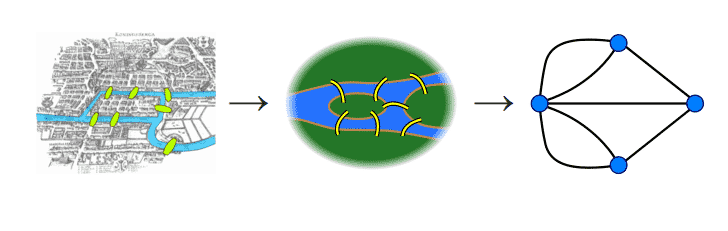

---

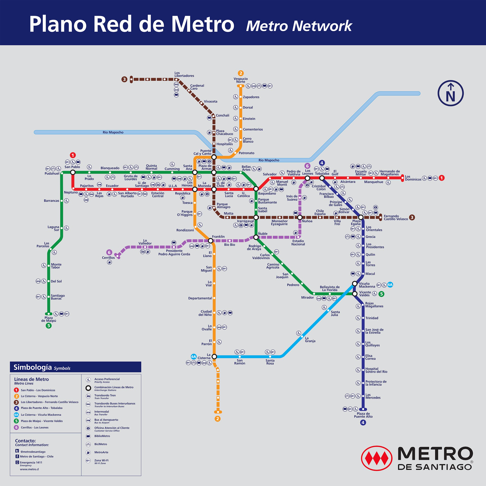

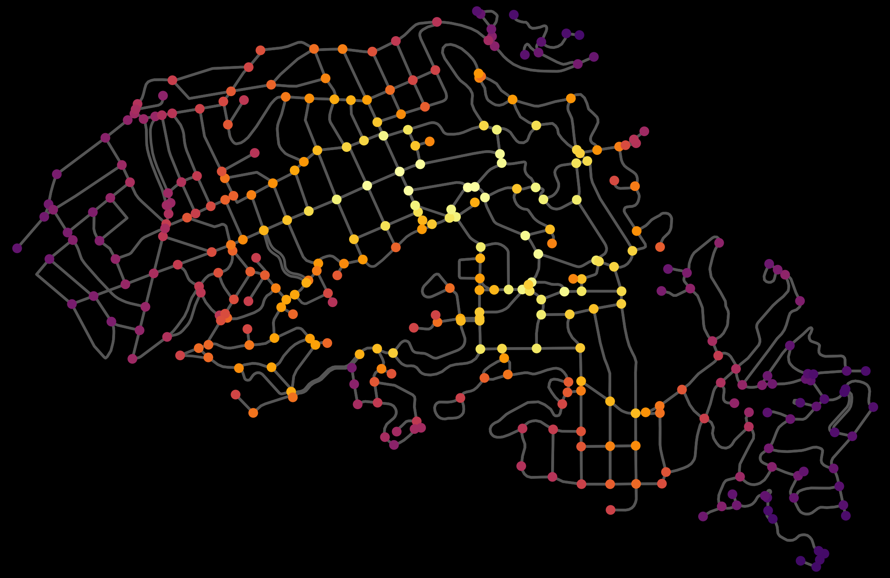

---

## Grafos: definiciones

- **Camino**: Secuencia de nodos conectados por arcos.
- **Conexo**: Grafo en el que existe un camino entre cualquier par de nodos.
- **Grado**:
  - **Grafos no dirigidos**: Número de arcos incidentes en un nodo.
  - **Grafos dirigidos**
    - **Grado de entrada**: Número de arcos que llegan a un nodo.
    - **Grado de salida**: Número de arcos que salen de un nodo.
- Dos nodos son **adyacentes** si están conectados por un arco.

---

## Grafos: definiciones

- **Árbol**: Grafo conexo sin ciclos.
  - Su importancia radica en que los árboles son grafos que conectan todos los vértices utilizando el menor número posible de aristas.
- **Ciclo**: Camino que comienza y termina en el mismo nodo.
  - **Ciclo simple**: Ciclo que no repite nodos.
  - **Ciclo hamiltoniano**: Ciclo que pasa por todos los nodos del grafo.
- **Camino hamiltoniano**: Camino que pasa por todos los nodos del grafo.

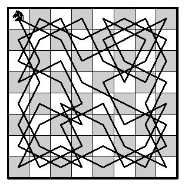

---

## Grafos: representación

- **Matriz de adyacencia**: Matriz cuadrada donde cada celda indica si existe un arco entre los nodos.
- **Lista de adyacencia**: Lista de nodos adyacentes a cada nodo.

---

## Grafos: matriz de adyacencia

<small>

Se utiliza una matriz M de tamaño $n \times n$ donde $n$ es el número de nodos del grafo y cada elemento `M[i][j]` almacena un valor booleano que indica conexión o no.

- **Ventajas**:
  - Fácil de implementar.
  - Fácil de verificar si existe un arco entre dos nodos.
- **Desventajas**:
  - Espacio en memoria.

</small>

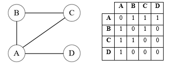

---

## Grafos: matriz de adyacencia

```java

public class Graph {
    private int V;
    private boolean[][] adj;

    public Graph(int V) {
        this.V = V;
        adj = new boolean[V][V];
    }

    public void addEdge(int u, int v) {
        adj[u][v] = adj[v][u] = true;
    }

    public boolean hasEdge(int u, int v) {
        return adj[u][v];
    }
}
```

---

## Grafos: lista de adyacencia

<small>

Se utiliza una lista de nodos adyacentes a cada nodo.

- **Ventajas**:
  - Ahorro de espacio en memoria.
  - Fácil de recorrer los nodos adyacentes.
  - Fácil de agregar o eliminar nodos.
- **Desventajas**:
  - Díficil de verificar si existe un arco entre dos nodos.
</small>

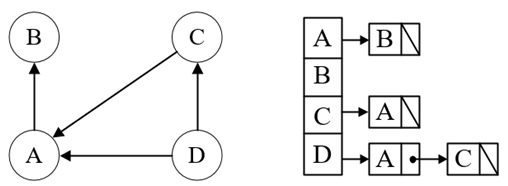

---

## Grafos: lista de adyacencia

```java

import java.util.LinkedList;

public class Graph {
    private int V;
    private LinkedList<Integer>[] adj;

    public Graph(int V) {
        this.V = V;
        adj = new LinkedList[V];
        for (int i = 0; i < V; i++) {
            adj[i] = new LinkedList<>();
        }
    }

    public void addEdge(int u, int v) {
        adj[u].add(v);
        adj[v].add(u);
    }

    public boolean hasEdge(int u, int v) {
        return adj[u].contains(v);
    }
}
```

---

## Grafos: recorridos

- Un recorrido es un algoritmo que visita todos los nodos de un grafo
- Los Algoritmos más usados para recorrer grafos generalizan los recorridos en árboles
- BFS: Breadth First Search
  - Recorre el grafo por niveles
- DFS: Depth First Search
  - Recorre el grafo en profundidad
  - Preorder, inorder, postorder

---

## Grafos: recorrido por niveles (BFS)

- El recorrido por niveles o amplitud, o Breadth-first search (BFS), utiliza un TDA FIFO para manejar el orden de visita de los nodos del grafo
  - en cada paso incorpora los nodos adyacente al nodo que se esta revisando.
  - eso implica que visitará todos los hijos de un nodo antes de proceder con sus demás descendientes

---

## Grafos: recorrido por niveles (BFS)

```java
void bfs(int s) {
    boolean[] visited = new boolean[V];
    LinkedList<Integer> queue = new LinkedList<>();
    visited[s] = true;
    queue.add(s);
    while (queue.size() != 0) {
        s = queue.poll();
        System.out.print(s + " ");
        for (int n : adj[s]) {
            if (!visited[n]) {
                visited[n] = true;
                queue.add(n);
            }
        }
    }
}
```

---

## Grafos: recorrido en profundidad (DFS)

- El recorrido en profundidad o Depth-first search (DFS) utiliza un TDA LIFO para manejar el orden de visita de los nodos del grafo
  - en cada paso incorpora los nodos adyacente al nodo que se esta revisando.
  - eso implica que visitará todos los descendientes de un nodo antes de proceder con sus hermanos

---

## Grafos: recorrido en profundidad (DFS)

```java
void dfs(int s) {
    boolean[] visited = new boolean[V];
    Stack<Integer> stack = new Stack<>();
    visited[s] = true;
    stack.push(s);
    while (!stack.isEmpty()) {
        s = stack.pop();
        System.out.print(s + " ");
        for (int n : adj[s]) {
            if (!visited[n]) {
                visited[n] = true;
                stack.push(n);
            }
        }
    }
}
```

---

## Grafos: spanning tree (árbol de recubrimiento)

<small>

- Dado un grafo `G`, un <u>**árbol de recubrimiento**</u> (ST) es un subgrafo conexo acíclico (es decir, un árbol) que contiene todos los vértices de `G`.
- Si el grafo es ponderado, cada arista tiene un peso asociado o coste.
  - En tal caso, el coste total del árbol de recubrimiento es la suma de los pesos de todas las aristas del árbol.
  - El <u>**árbol de recubrimiento mínimo**</u> (MST) es el árbol de recubrimiento cuyo coste total es mínimo.

</small>

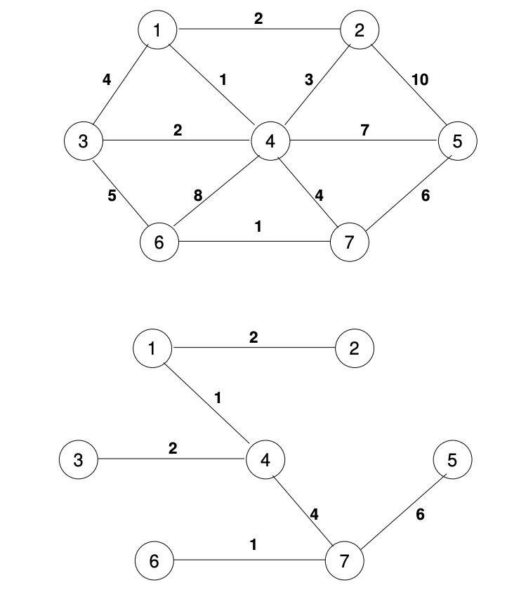

---

## Grafos: spanning tree

<small>
 
 - Problema: minimizar el cableado que se necesita para conectar la red telefónica de una ciudad.

</small>

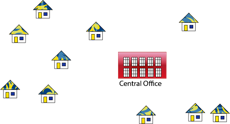

---

## Grafos: spanning tree

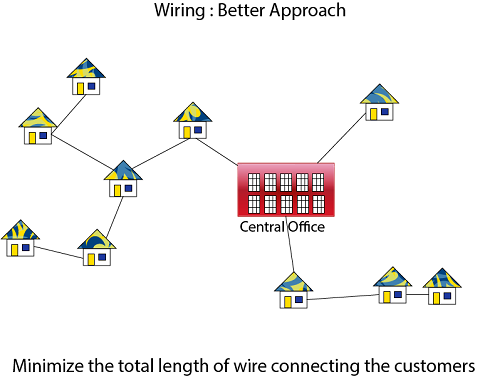

---

## MST: Algoritmo de Prim

- El algoritmo de Prim es un algoritmo **greedy** que encuentra un árbol de recubrimiento mínimo para un grafo ponderado conexo.
- El algoritmo mantiene un conjunto de nodos que ya han sido incluidos en el árbol de recubrimiento mínimo.
- En cada paso, el algoritmo busca el nodo más cercano (cuya arista tenga menor peso) al conjunto de nodos incluidos y lo agrega al árbol.
- El algoritmo termina cuando todos los nodos han sido incluidos en el árbol.

---

## MST: Algoritmo de Prim


---

## MST: Algoritmo de Prim

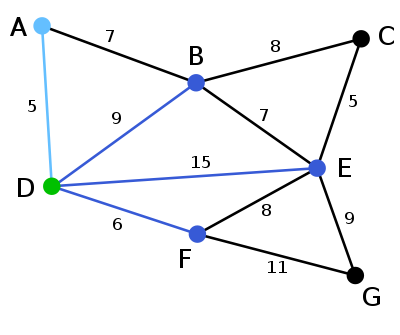

---


## MST: Algoritmo de Prim

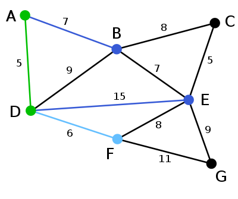


---

## MST: Algoritmo de Prim

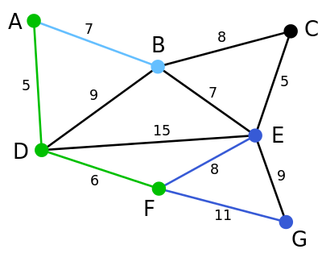


---

## MST: Algoritmo de Prim

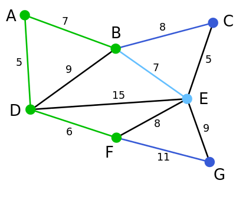


---

## MST: Algoritmo de Prim

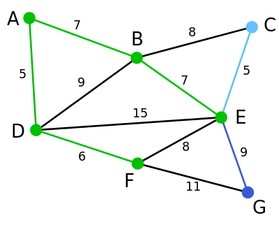


---

## MST: Algoritmo de Prim

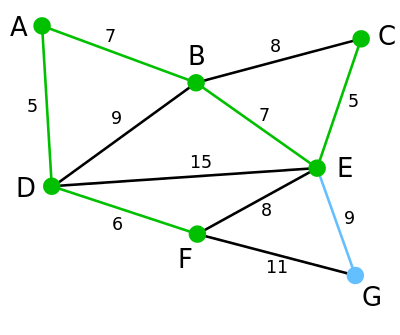


---


## MST: Algoritmo de Prim

```java
public void prim(int[][] graph) {
    int V = graph.length;
    int[] parent = new int[V];
    int[] key = new int[V];
    boolean[] mstSet = new boolean[V];
    Arrays.fill(key, Integer.MAX_VALUE);
    key[0] = 0;
    parent[0] = -1;
    for (int i = 0; i < V - 1; i++) {
        int u = minKey(key, mstSet);
        mstSet[u] = true;
        for (int v = 0; v < V; v++) {
            if (graph[u][v] != 0 && !mstSet[v] && graph[u][v] < key[v]) {
                parent[v] = u;
                key[v] = graph[u][v];
            }
        }
    }
}
```

---

## MST: Algoritmo de Kruskal

- El algoritmo de Kruskal es un algoritmo **greedy** que encuentra un árbol de recubrimiento mínimo para un grafo ponderado conexo.
- El algoritmo mantiene un conjunto de aristas ordenadas por peso.
- En cada paso, el algoritmo selecciona la arista de menor peso que no forma un ciclo con las aristas seleccionadas previamente.
- El algoritmo termina cuando todas las aristas han sido incluidas en el árbol.

---

## MST: Algoritmo de Kruskal


---

## MST: Algoritmo de Kruskal

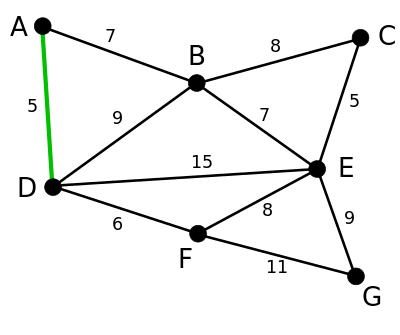

---

## MST: Algoritmo de Kruskal

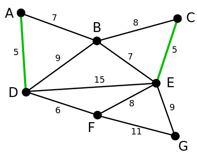

---

## MST: Algoritmo de Kruskal

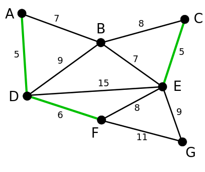

---

## MST: Algoritmo de Kruskal

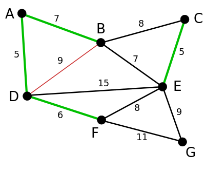


---

## MST: Algoritmo de Kruskal

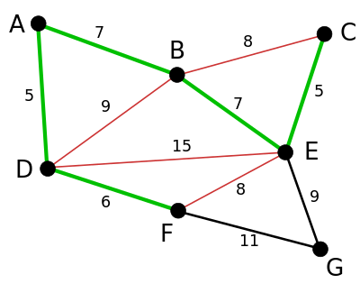

---

## MST: Algoritmo de Kruskal

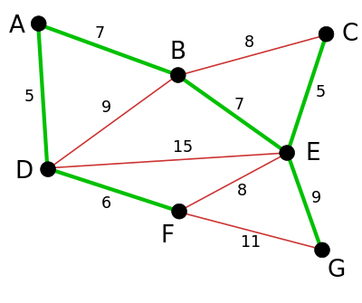


---


- [Kruskal en java](https://youtu.be/JptKmWQSerU?si=no-3ICozb8z6pTXB)
- [Wikipedia graph](https://youtu.be/JheGL6uSF-4?si=wtUFa1uvPS2Zd88o)
- [Algoritmos greedy](https://youtu.be/ALtJncFD8N8?si=rhqoo6Q_srfN3O8e)
